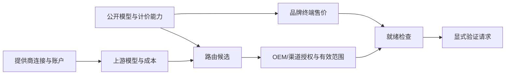
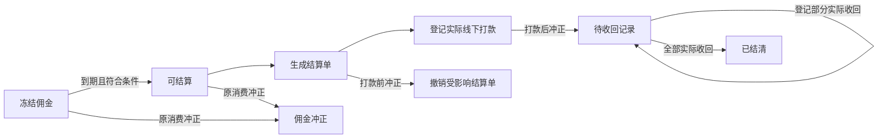

# TokenHub 产品流程与交互整改方案

状态：**首轮与2026-10-10业务补充均已完成本地实施验收，证据见docs/26、30**。更新日期：2026-10-10。审查代码基线：`release/v0.1.0`，`64e1825`。
实施入口：[sol 整改执行任务书](19-sol整改执行任务书.md)；用户端细化：[API Key 与模型使用说明设计](20-API-Key与模型使用说明设计.md)。本文定义目标体验与业务边界，任务书定义实施顺序，细化文档定义 Key 限制及两类使用说明。

本版重点修订第 1、5、7、10、12 节：统一名称、简化 OEM 交接、放宽线下记账材料、改为 Key 优先和按需查看使用说明。用户已明确允许按业务诉求大改或重构，无需逐页保留旧设计，也不要求用户逐项阅读其余章节。

## 2026-10-10 实施补充（最新业务决定）

本轮已获授权开始实施；实现与验证状态以 [整改实施记录](21-整改实施记录.md) 为准。历史“仅文档、尚未启动”描述只表示审查阶段。

普通用户是在标准 API 中转站账户上增加邀请能力。专属邀请码/链接、已邀请人数、赠送积分、分佣资格取得方法及达线进度、个人推广所得佣金全部集中在同一账户的“邀请与收益”。每名注册用户均可邀请；有资格后展示真实佣金和结算，不需要另开推广账户或独立后台。旧 `/partner` 能力迁入有权收益视图，普通用户登录仍进入 `/app`；管理岗位按原权限进入工作区。邀请两跳、API 消费计佣、充值不计佣、赠送积分与佣金钱包隔离均不改变。

验收补充：无资格的新用户可复制本人邀请码/链接、查看已邀请人数与赠送积分及达线进度；取得资格后在同一“邀请与收益”查看个人佣金和结算；本人信息与专业推广客户范围仍由服务端隔离，无另建账户、权限自选或额外开户流程。

## 1. 整改结论与已确认决策

当前产品把数据库实体、管理接口和开发阶段的能力入口直接变成了导航。用户要完成一件事，必须自己知道对象间的依赖、寻找多个页面、复制编号、判断哪个状态才算成功。页面上的长说明在补偿这些缺口，却又增加了阅读负担；部分说明还保留了已经废止的业务规则。

整改应围绕完整任务重新设计：**平台把服务和 OEM 交付到可营业，OEM 完成日常经营，普通用户接通已有工具或 SDK。** 删除说明文字只能是结果，不能是主要手段。要先让页面呈现正确对象、真实状态、可执行的下一步和明确的完成结果。

### 1.1 本轮用户已确认

| 决策 | 本轮确认内容 | 对方案的约束 |
| --- | --- | --- |
| D18-01 | 平台运营与 OEM/渠道优先，普通用户其次 | 先贯通交付、经营、收款、结算、异常处理，再改用户接入 |
| D18-02 | 用户先生成 Key 并设置可用模型、USD 额度上限、有效期，再按需要查看 Agent 配置说明或模型调用协议 | API Key 是首要入口；说明按模型与使用方式提供，不强制先选工具或通过引导验证 |
| D18-03 | 平台协助 OEM 配置到可营业，再交给 OEM 日常运营 | 必须有可恢复的交付流程、就绪检查和交接结果 |
| D18-04 | 同一品牌必须统一终端售价，渠道只影响推广归属和佣金 | 不设计渠道的终端客户价；渠道不成为收款、采购或库存主体 |
| D18-05 | 产品未上线，整个项目都可以大改或重构，只要合乎业务、合理简单好用 | 可以重做架构、接口、组件、导航与旧规范；已有实现不是必须保留的约束 |
| D18-06 | 审查阶段仅写方案；之后用户已授权 GPT-6.1 Sol（极高）实施，并由根代理全权协调 | 实施已获授权；不等于授权真实付款或生产部署 |
| D18-07 | 业务名称统一为平台、OEM、渠道 | 产品、帮助、错误、导出和新业务文档均使用新名称；旧代码映射只保留在迁移说明 |
| D18-08 | 线下走账可能没有正式或专业票据，不应卡得太严 | 不强制发票、附件、银行流水号；简单说明或参考号可选，系统生成内部记录号 |
| D18-09 | 普通用户不需要也不能指定提供商或路由策略 | 页面、公开文档和用户请求接口都不开放上游选择；模型仍由用户选择 |
| D18-10 | 请求前合理预估并核验额度；已准入请求按可靠实际用量全额扣费，允许 Key 超上限、账户负余额 | 不截断消费、不因超预估留待对账；余额与Key不足时不接受新请求；充值补齐账户但不清零Key |
| D18-11 | 平台与OEM独立经营；OEM终端计费150、实际平台结算成本100，毛利50；OEM付款并收到服务额度时双方采购交易完成 | 平台不依赖OEM终端售价确认自身经营；采购现金与实际消耗成本分开展示，不重复扣除 |
| D18-12 | 项目全部现有数据为测试数据；差异过大可清理，无需复杂历史兼容 | 按需重建隔离测试数据，不为旧无主推广关系开发迁移；正常业务的幂等、原事实和冲正仍必须正确 |
| D18-13 | 正式运营资料尚未准备，目标支持主流模型与地区；Agent配置和代码接入说明现在完善 | 文档采用当前品牌地址、公开模型和已实现协议；运营主体等资料上线前补齐，不能把支持目标写成已验证事实 |

### 1.2 本方案推荐的主要改变

1. 平台与 OEM 首页突出待完成任务和异常；渠道突出客户与佣金，普通用户突出 API Key，移除说明卡片和无意义空图表。
2. 建立 OEM 交付详情，把品牌、域名、模型、价格、服务额度、收款和管理员交接连成一条可恢复的流程。
3. 模型服务保留提供商、公开模型、路由、授权的业务分工，但由状态检查和上下文跳转把它们串起来。
4. 日常经营围绕客户、订单、请求、结算单开展；对象详情直接提供关联记录与有权限的操作，取消常规任务中的跨页抄 ID。
5. 把佣金日常结算与低频策略配置分开，把异常处理与报表阅读分开。
6. 全站统一身份、范围、状态、列表和提交反馈；删去失效入口、旧规则、开发调试说明与虚假营销数据。
7. 用户从 API Key 出发设置使用边界，然后在同一模型详情查看“Agent 配置”或“调用协议”；不增加必须走完的首次接入向导。

### 1.3 不因交互重构而改变的业务事实

- 平台经营官方品牌并管理直属 OEM 与渠道；OEM 经营独立品牌并管理自己的直属渠道；渠道继承所属平台或 OEM 的品牌，不能再建立下级组织。
- 平台和 OEM 收款。渠道没有独立积分池、商户配置、收款、购买或划拨操作。OEM 的终端客户，包括其下属渠道的客户，从 OEM 的服务额度池发放额度。
- OEM 不维护上游提供商、上游密钥、路由或网关基础设施。平台协助交付不等于平台取得 OEM 日常收款、退款权限。
- 充值不计佣；已确认 API 消费按原规则计佣，邀请链最多向上两跳。API 额度与佣金钱包分开。
- 现金退款、消费冲正、预授权释放、佣金冲正、已打款佣金追回是不同动作，不合成一个“退款”按钮。
- 正常业务的财务事实、价格与佣金快照、幂等、成对冲正、审计、品牌隔离和服务端权限检查继续有效。用户已授权按需清理未上线测试数据；不为测试数据开发复杂历史兼容，也不在普通业务操作中静默改写原账务。
- 套餐权益、赠送积分、充值积分分别保留有效期与使用条件，不能为简化页面而强行合并成一个可退款余额。

## 2. 审查范围与证据边界

### 2.1 覆盖范围

仓库中发现 **121 个 `page.tsx` 路由文件**：平台 32、OEM/渠道共用路径 30、用户控制台 20、推广者 4、公共站与认证 35。对全部路由做了入口盘点，对核心流程组件、权限配置、账务与目录相关服务、现行业务文档进行了定向审查。完整路由处置表见任务书。

浏览器走查了测试站公共首页、登录页，以及本地运行环境的平台总览、渠道创建、佣金策略、OEM 首页、渠道首页及权限死路、普通用户首页和创建 Key 弹窗等。浏览器观察与源码证据互相核对，但**未逐一执行 121 个页面的所有分支**。

| 证据种类 | 本次做了什么 | 不代表什么 |
| --- | --- | --- |
| S：源码证据 | 路由、组件、文案、接口调用、状态处理、相关后端规则 | 不能证明每个部署环境都运行了同一提交 |
| U：界面观察 | `http://localhost:9080` 的开发种子账户只读走查；测试站公共页面观察 | 不是正式环境验收，也不是客户可用性测试 |
| R：业务依据 | 用户本轮确认；docs/12、15、16、17 等与实现对照 | 旧文档中互相冲突的条款不自动成为本次目标 |

本次没有真实充值、打款、退款、发放额度、创建密钥、变更策略或发送计费 API 请求。没有真实用户行为数据，因此“常见任务”“优先展示”是基于业务职责的设计判断，后续要通过任务测试验证。

### 2.2 可复现的典型观察

| 编号 | 复现过程 | 观察结果 | 结论边界 |
| --- | --- | --- | --- |
| U01 | 渠道管理员进入 `/channel`，点击首页“收款” | 进入无权限页面；侧栏却已经隐藏收款 | 首页推荐与权限菜单不一致；不表示后端越权 |
| U02 | 平台打开 `/admin/commission`，先看初始值，再点击“读取策略” | 总佣金从 `2500` 变成实际读取的 `2000`；读取前已经提供保存操作 | 初始可编辑值不是当前配置；本次未保存 |
| U03 | 平台渠道列表打开“创建渠道”，选择 OEM | 要求填写品牌 ID，需另行知道或创建品牌 | 创建入口不组织其必要前置条件 |
| U04 | 无 Key、无余额的普通用户进入 `/app` | 先展示总览术语与空图表，再出现“第一次使用”；首要操作是快速试用 | 首屏任务顺序与本轮确认目标相反 |
| U05 | OEM 进入 `/channel` | 首页仍解释 OEM 向渠道划拨、平台审核等旧业务 | 说明不仅多，而且会指导错误行为 |
| U06 | 测试站公共首页 | 无可用模型数据时仍有固定模型宣传、排行与演示充值；示例曾显示 `https://localhost` | Base URL 问题需分环境核对配置；本地示例正常，不能笼统判为所有部署都错 |

## 3. 问题清单：从阻断任务到增加负担

优先级含义：**P0 为上线前必须消除的错误操作或错误事实风险；P1 为主任务不能顺畅闭环；P2 为可发现性、一致性与效率问题。** 这是整改优先级，不是安全漏洞评级。每条均有可观察验收结果，不能只以改了文字关闭。

| ID / 优先级 | 具体触发与现状 | 用户后果 | 必须达到的整改结果 | 证据 |
| --- | --- | --- | --- | --- |
| F01 / P1 | 首页、侧栏、详情链接分别组织能力；平台配置 22 个菜单项，OEM 由平台菜单过滤派生为 18 项 | 先学习系统分层，再寻找任务；页面缩减没有减少任务断点 | 按职责独立定义导航和首页；同一能力使用同一权限与范围来源 | S01、U01 |
| F02 / P0 | 佣金策略初始硬编码值可编辑可保存，真实配置要手动读取 | 以为正在编辑当前策略，实际可能覆盖成默认值 | 自动读取成功且有版本后才可编辑；读取失败不出现可提交默认配置 | S02、U02 |
| F03 / P0 | 渠道首页推荐收款和账本，文案仍称 OEM 可给渠道划拨 | 错误理解资金主体；不断进入无权限页 | 渠道所有首页、菜单、搜索、深链都按同一权限矩阵呈现 | S03、U01、U05 |
| F04 / P1 | 创建 OEM 要填品牌 ID；管理员、域名、模型、额度、收款散在多个页 | 创建成功不等于能营业，也不知道下一步 | 从创建进入交付详情；逐项呈现阻塞项、责任人和继续入口 | S04、U03 |
| F05 / P1 | 新建渠道成功后只提示继续授权模型和管理员 | 操作者仍需回列表找刚创建对象 | 成功进入该渠道的开通详情，保留已完成项和注册交接入口 | S05 |
| F06 / P1 | 提供商账户池在详情底部，公开模型、上游模型、报价与路由互相用说明指路 | 先做后续步骤才发现上游账户或成本缺失 | 按可完成任务组织；缺项有对象级修复入口并带回原任务 | S06 |
| F07 / P1 | 已发布模型总是链接“新建路由”，不根据已有路由改变操作 | 到新建页又不能选择已绑定模型 | 有路由进入对应路由；无路由才创建；可调用状态覆盖整个依赖链 | S07 |
| F08 / P1 | 模型授权空列表只给总入口和说明 | 不知道是没发布、没路由、被撤权还是加载失败 | 按原因分类显示，并只提供当前角色能执行的修复动作 | S08 |
| F09 / P1 | `/channel/commissions` 实际读额度与发放记录，金额部分直接输出微单位 | 佣金和额度混淆，数值不可读 | 佣金只呈现佣金事实；发放归客户/额度流水；统一金额格式 | S09 |
| F10 / P1 | 佣金页先放策略、资格和重算，再长列表与结算表单 | 财务高频任务埋在底部；点登记后表单可能在视口外 | 默认待结算工作队列；规则独立；对象操作就地打开抽屉/详情 | S02、S10 |
| F11 / P0 | 供应商支出每次提交现场生成新幂等键 | 超时后重试可能作为另一笔支出；源码确认风险，未实测重复入账 | 同一操作复用幂等身份，未知结果先查；修改内容才开新操作 | S11 |
| F12 / P1 | 客户列表没有贯通余额、订单、请求、归因、佣金的客户详情 | 客服要在多页抄 ID，容易丢对象和范围 | 客户详情作为服务入口，链接真实关联对象；不授予新数据权限 | S12 |
| F13 / P1 | 消费退款和佣金核对要求从其他页面复制请求编号 | 切页、抄错、找不到回程 | 从请求详情预填对象并显示影响预览；手输编号仅留诊断备用入口 | S13 |
| F14 / P0 | 待对账按钮叫“标记已解”，实际会作废并释放预授权 | 把资金处置误当普通待办关闭 | 动作写明“作废并释放预留额度”，显示金额与后果；有真实用量走另一分支 | S14 |
| F15 / P1 | 对账详情与可见列表使用两套 query key；处理后仅刷新其中一套 | 已处理对象可能仍显示在待办表 | 对象、列表、计数、余额相关缓存一致失效；回读失败与提交失败分开 | S14 |
| F16 / P1 | 告警显示数量/技术说明，应急手册另列接口与操作步骤 | 看到问题但无法带着证据去处理 | 异常列表到请求/订单/模型详情闭环，规则按异常就地出现 | S15 |
| F17 / P0 | 健康指标缺 alerts 时默认为 READY；最近 100 条被用于趋势汇总 | 未知看起来正常，局部样本容易被读作周期总量 | 区分未知、失败、陈旧与正常；周期汇总由服务端完整范围计算 | S16、S17 |
| F18 / P1 | 普通用户首页在首次接入前显示空图表，首要 CTA 是试用 | 不知道如何接到自己已有工具 | 首屏提供 Key 创建/管理，核心限制可直接设置；创建后可选 Agent 配置或调用协议，不强制向导 | S17、U04 |
| F19 / P1 | Key 创建已有示例和验证，但模型、文档、余额分散在不同页 | 已有好的局部能力没有形成连续旅程 | 复用现有能力，保留工具、协议、模型、Key 和返回位置 | S18 |
| F20 / P1 | 公共首页另做一套固定 1 USD/Stripe 的购买逻辑、默认兑换码 THE2E | 用户在演示入口与正式收银台之间遇到不同规则 | 公共站只选商品/发起意图；统一进入正式报价与结账流程 | S19 |
| F21 / P0 | 公共套餐卡片统一标“每月”，实际套餐支持一次、季、年等周期 | 对扣款周期形成错误预期 | 所有价格卡以实际币种、周期、有效期和续费条件渲染 | S19、S20 |
| F22 / P1 | GitHub 登录按钮可点击，处理函数仅返回未实现 | 在认证入口制造死路 | 未配置且不支持的身份方式不展示为可操作按钮 | S21 |
| F23 / P2 | 公共页堆多种入口、固定宣传和外部站内容快照 | 产品定位不清，可用数据与宣传互相矛盾 | 公共站围绕真实可用模型与接入；移除未验证排行和示例促销 | S27、U06 |
| F24 / P1 | 通用列表无游标导航；多页只取/本地筛选最近 100 条 | 数据一多就查不到；回退丢查询条件 | 服务端分页与搜索，URL 保留条件；汇总与当前页数据分离 | S22 |
| F25 / P2 | 行点击无明确链接，短表也统一最小宽度，表单字段依赖 placeholder/aria-label | 键盘不可发现、窄屏横滚、填后失去字段含义 | 原生对象链接、持续可见标签、按列定义宽度与移动展示 | S22、S02 |
| F26 / P1 | 设置混放个人安全、阈值、熔断、灰度、演练、域名和品牌 | 改个人偏好也需要辨识生产操作 | 个人设置、组织设置、技术运维明确分区并按权限呈现 | S23 |
| F27 / P2 | 用户设置展示 4 个不可用入口，管理页重复泛化 H1 | 增加无效选择；打开后仍不知身处何页 | 隐去未完成能力；页面标题使用真实任务或对象名称 | S01、S24 |
| F28 / P1 | 文档 17 仍允许逐渠道客户价覆盖，但新规则和现有价格服务已走品牌继承 | 后续实现可能把已消除的业务分歧重新引入 | 同步权威文档、测试和 UI，保护品牌统一售价已有实现 | S25 |
| F29 / P2 | 代理/个人推广创建仍用固定旧层级标签和示例 ID | 误把计佣两跳当作组织只能两层，创建时需懂内部 ID | 选渠道/上级对象，显示关系而非旧固定层级，计佣单独展示 | S04、S26 |
| F30 / P1 | 套餐管理默认强调审核；OEM 文案仍说平台审核，但已有本品牌发布能力 | 经营者不知道谁负责发布、何时可售 | 本品牌创建→预览→发布；状态与收款就绪单独显示 | S20、S03 |
| F31 / P1 | Key 创建只接收名称、模型白名单、RPM 与并发；已有过期字段但未进入完整创建/编辑流程，也没有独立 USD 消耗上限 | 用户无法按已确认诉求给某个 Key 设置花费和时间边界 | 补齐创建/编辑/详情与后端额度占用、结算、到期校验；不限与指定模型必须明确 | S31 |
| F32 / P1 | 普通网关请求仍读取 `provider.only/ignore/order` 查询参数 | 用户可向内部技术策略传入上游选择要求，与本轮边界冲突 | 公开调用不接受提供商/路由控制；内部诊断使用独立有权入口 | S32 |

以上优先级不意味着只修 P0 即可上线；核心任务仍须整体通过第 16 节验收。

## 4. 目标交互规则

### 4.1 页面围绕“完成一件事”组织

一个页面可以聚合多个领域的只读事实和有权限的动作，但后端领域职责不混合。例如客户详情可显示订单、额度与请求，不等于重新实现三套账务；OEM 交付可以编排品牌与支付就绪，不等于把平台变成 OEM 收款主体。

每个关键页面必须回答四个问题：**正在处理谁；现在什么状态；下一步做什么；完成后有什么变化。** 在首屏无法回答时，应调整结构，不能追加一段教程。

### 4.2 权限、前置条件与服务故障分开

| 情况 | 呈现方式 | 例子 |
| --- | --- | --- |
| 角色没有该职责 | 导航、快捷入口、对象动作都不展示；直接访问返回清楚的无权限页和有效回程 | 渠道没有收款入口 |
| 有权限但缺少前置条件 | 显示任务及具体缺项，提供补齐入口；保留原任务 | 已有模型，缺上游报价 |
| 依赖服务暂时失败 | 显示加载失败、重试与最近更新时间，不显示为空/零/正常 | 无法读取支付配置 |
| 完成状态待异步确认 | 显示“已提交，待确认”并能查询，不再次创建 | 已付款但额度发放待完成 |
| 高风险操作 | 显示具体对象、金额/范围、后果与确认；只在最终提交处确认 | 撤销模型授权、登记打款 |

### 4.3 统一业务名词

| 面向谁 | 主界面名称 | 仅在详情/诊断中保留 |
| --- | --- | --- |
| 所有人 | 平台、OEM、渠道 | 历史类型代码、组织 ID；不把 OEM 与渠道统称为“渠道” |
| 终端用户 | API 可用额度、预留额度、到期时间、实际花费 | HOLD、reserved_minor、三桶、usage_event |
| 财务/OEM | 实收金额、发放额度、来源额度池、佣金余额、待收回款项 | 微单位整数、BPS、数据表名 |
| 平台技术 | 提供商、账户、上游模型、公开模型、路由 | Adapter 标识、请求/attempt ID 可在技术详情复制 |
| 平台/OEM 运营 | 品牌售价、平台结算价、套餐售价 | customer_override_json 等存储字段 |

“接入成功”只用于有成功请求证据的情况；“配置已复制”不等于“工具已接通”。“已登记打款”不表示系统发起了转账。“可营业”不等于 `channel.status=active`。

## 5. 四类用户的信息架构

导航使用独立的角色配置与共同能力定义；不再用“平台菜单删几项”生成 OEM 导航。下面为推荐结构，一级项是任务领域，二级列表默认折叠；角色无权限时整项消失。一级项数量是这版方案的结果，不作为机械考核指标。

### 5.1 平台：七个一级领域

| 一级 | 默认内容 / 二级 | 核心动作 |
| --- | --- | --- |
| 工作台 | 我的待办、交付中 OEM、资金异常、服务异常 | 继续处理 |
| 客户与合作方 | 客户；OEM 交付；直属推广渠道；推广关系 | 开通 OEM、创建渠道、打开客户 |
| 模型与套餐 | 公开模型；提供商；路由；官方品牌套餐 | 完成模型供应链、发布可售产品 |
| 资金与结算 | 收款与发放；消费调整；佣金结算；经营账本 | 处理订单、发放、核对、登记 |
| 异常处理 | 请求异常；订单/发放异常；服务告警 | 查明原因并完成处置 |
| 经营分析 | 用量、收入/成本/毛利、营销支出 | 在同一时间与范围下分析，并钻取对象 |
| 设置 | 官方品牌与域名；员工权限；支付配置；技术运维；审计 | 低频配置与审计 |

模型终端售价的唯一编辑入口放在模型详情“官方品牌售价”；OEM 的品牌售价在 OEM 端对应模型详情。其他页面展示当前价并链接该编辑入口，不复制价格表单。

平台运营先看到 OEM 交付、客户与业务待办；技术岗位先看到服务与请求异常；财务先看到收款、发放、结算；审计看只读记录。多角色用户选择默认工作台，不让固定角色优先级反复把人送错门户。

### 5.2 OEM：经营自己的品牌

| 一级 | 内容 | 明确边界 |
| --- | --- | --- |
| 工作台 | 开通进度或经营待办、可发放额度、异常 | 交付完成前优先补齐条件；完成后优先日常任务 |
| 客户与推广 | 客户、直属渠道、推广关系 | 不展示其他品牌或其他 OEM 的对象 |
| 模型与套餐 | 已授权模型、品牌统一售价、品牌套餐 | 无提供商、上游密钥、路由编辑 |
| 资金与结算 | 收款/发放、佣金结算、服务额度记录、经营账本 | 当前 OEM 为收款与资金主体 |
| 异常处理 | 订单、发放、客户请求、媒体状态 | 技术根因由平台处理；提供可引用的请求编号 |
| 经营分析 | 本品牌与直属渠道的用量、收入、平台成本、毛利 | 不暴露平台的上游报价；毛利与经营盈亏分别呈现 |
| 品牌与团队 | 品牌外观、域名状态、支付设置、员工权限、审计 | 个人安全仍在账户菜单 |

范围选项使用“全品牌”“直属客户”与具体渠道；“全品牌”包含直属客户与下属渠道客户，避免用“全部渠道”混称。选择某渠道只改变统计/客户归属过滤，不能让渠道变成当前收款主体。页面始终可见品牌范围，跨页面保留筛选；切换品牌要清空不兼容对象，不能串用缓存。

### 5.3 渠道：推广渠道管理

一级保留：**工作台、客户、推广、已授权模型、我的佣金**。Key 与请求从有权限的客户详情查看；只展示所需元数据，管理者不取得客户完整 Key。

不展示额度池、收款、采购、支出、资金划拨、品牌设置、套餐发布或分佣策略编辑。不再沿用 OEM 的池余额卡片。模型可以在上级授权范围内本地上下架；不能越过上级撤权。我的佣金使用佣金事实，绝不指向额度发放列表。

### 5.4 普通用户与推广者

主要导航：**API Key、模型、用量与请求、余额与套餐、邀请与收益、设置**。API Key 独立可见；首次登录首页的主操作是创建 Key，已有 Key 时直接显示其状态与常用模型。网页试用、媒体生成列为辅助工具，不影响 API 使用主线。

Key 创建成功后提供“Agent 配置”和“代码调用”两个入口，带入该 Key 的可用模型。模型详情也提供这两个入口，已熟悉用法的用户可以直接复制 Key 和模型 ID 开始调用。用户不必先选 Agent、完成教程或通过站内测试才能拿到 Key。

用户“用量与请求”内分汇总、请求明细；对账相关信息进入账单/请求详情，避免与平台财务对账同名。余额与套餐内分额度、充值/购买、订单/流水；权益到期信息保留。

推广者 `/partner` 的客户与收益能力整合到“邀请与收益”的专业视图，权限仍由服务端限定，旧地址跳转到对应标签页。组织管理员与推广者是不同权限，不因合并界面自动互授。

### 5.5 关键权限矩阵

| 行为 | 平台相关岗位 | OEM 相关岗位 | 渠道 | 普通用户 |
| --- | --- | --- | --- | --- |
| 配置上游、路由 | 技术/管理员 | 无 | 无 | 无 |
| 开通 OEM 并协调交付 | 平台有权岗位 | 查看自己的交付 | 无 | 无 |
| 创建和交接渠道 | 仅平台直属渠道 | 仅 OEM 直属渠道 | 无 | 无 |
| 制定终端售价/套餐 | 官方品牌 | 自己品牌 | 无 | 无 |
| 收款、发放、现金退款 | 仅官方品牌 | 仅自己品牌 | 无 | 仅发起自己的购买/查看 |
| 调整 OEM 向平台取得的服务额度 | 按现有平台资金权限 | 查看自己的记录 | 无 | 无 |
| 本地模型上下架 | 管理范围内 | 自己及授权规则允许的范围 | 自己已授权模型 | 无 |
| 结算与线下打款登记 | 自己品牌有权财务 | 自己品牌有权财务 | 查看本人记录 | 查看本人记录 |
| 员工权限修改 | 本组织管理员 | 本组织管理员 | 不自动扩展 | 无 |
| 查看技术/财务敏感详情 | 按现有细分权限 | 业务必要投影 | 最小必要投影 | 仅本人 |

表中是职责，不替代现有细粒度权限表。任何聚合接口也必须逐字段和逐动作检查权限；不能因为工作台要显示一个总数而绕过原有隔离。

## 6. 工作台：让用户立即知道下一步

### 6.1 平台工作台

首屏顺序为“范围与时间 → 待处理事项 → 继续交付 → 经营摘要”。没有数据时显示可开始的任务，隐藏空趋势图。每个数字都能进入相同范围、相同状态的列表；加载失败不能变成 0。

```text
平台工作台                         官方品牌 / 平台技术范围       今天 ▾

需要处理
订单待发放 3       待对账请求 6       待登记打款 2       服务异常 1
[查看订单]         [核对请求]         [处理结算]         [查看影响]

OEM 交付
品牌甲  待配置收款       品牌乙  待管理员验收
[继续交付]              [查看待验收项]

常用任务   [开通 OEM] [添加模型] [查找客户]
经营摘要   已确认收入 / 平台成本 / 毛利     （有数据才显示趋势）
```

上图数字只解释布局，不是当前运营数据。按岗位显示对应模块；不是为所有人同时放齐所有卡片。异常按状态实时归队，明确最近更新时间与待处理时长。不先引入复杂工单系统：一期用现有对象状态组成队列，需要跨人交接时才增加负责人/备注。

### 6.2 OEM 工作台

开通阶段显示交付清单；营业阶段显示“收款与额度发放、待结算、客户请求异常、服务额度不足”等能处理的事项。额度不足卡片显示本池可发放数量及相关订单，不显示平台的上游健康细节。

“今天收入”“待发放金额”“可发放 API 额度”分别注明币种或单位；不能把实收本币、USD 计价额度和佣金余额相加。经营指标保留计算口径在字段旁的短提示中，不放一段全页账务教材。

### 6.3 首屏状态

| 状态 | 首屏主操作 | 不应出现 |
| --- | --- | --- |
| 平台尚未配置模型 | 完成首个模型接入 | 假健康状态、空排行榜 |
| 有交付中的 OEM | 继续最近未完成交付，可查看全部 | “已创建”被当作“交付完成” |
| OEM 尚未营业 | 按责任人显示未完成项 | 收入趋势优先于开通流程 |
| 营业正常无待办 | 无待处理＋有效快捷操作＋经营摘要 | 为了填满页面制造告警 |
| 部分接口失败 | 局部错误、重试、已知数据时间 | 全页归零或静默隐藏问题 |

## 7. OEM 从开通到交接的完整流程

### 7.1 一个入口、一份可恢复的交付记录

入口为“客户与合作方 → OEM 交付 → 开通 OEM”。首次只填可识别名称和必要的品牌基础信息，OEM 标识默认生成；品牌可在流程内创建或选择尚未分配的品牌。内部 ID 自动关联，不让操作者手输 `brd_*`。

创建后立即进入交付详情，显示当前对象、品牌、营业就绪度、责任角色和未完成项。清单按真实配置自动完成检查，不要求重复填报、逐项签字或多级审批；一期不建设复杂交付工单系统。每个步骤保存自己的事实，刷新或离开后能继续。已创建的品牌/OEM 不会因取消后续步骤而被隐式删除；重复提交不会再建一个 OEM。


步骤条是建议顺序，不把无依赖步骤强制串行。域名等待验证时仍可配置模型；有权限的人可以直接打开任意待办项。

### 7.2 交付检查与责任分工

| 项目 | 完成事实 | 主责任人 | 未完成时页面动作 |
| --- | --- | --- | --- |
| 品牌与 OEM | 唯一 OEM 与品牌关系已建立，名称可识别 | 平台运营 | 创建/选择品牌 |
| 域名与 Base URL | 域名已验证，TLS/路由可用，品牌对外 API 地址正确 | 平台技术；OEM 提供域名信息 | 查看验证状态、复制 DNS 要求、重新检查 |
| 模型供应 | 至少一个目标模型已发布、有效路由可用、授权有效 | 平台技术/运营 | 打开该模型具体缺项 |
| 结算条件 | 对 OEM 的有效模型结算价完整，来源和版本清楚 | 平台有权岗位 | 补齐价格、查看变更影响 |
| 品牌售价 | 明确使用何套终端价，所有直属渠道客户继承 | OEM 有权岗位，平台协助核对 | 查看品牌价格表并预览 |
| 可发放额度 | OEM 取得服务额度，可支持约定的初始营业方式 | 平台资金岗位/OEM | 查看本池和取得额度记录；不静默赠送 |
| 收款方式 | 至少一种计划采用的方式已就绪；在线/线下分别标识 | OEM 财务，平台协助排查技术问题 | 在线测试配置或核对线下流程 |
| 套餐 | 选择售卖套餐时，售价、权益、有效期、续费与收款能力齐备 | OEM 运营/财务 | 预览并发布；纯按量营业不强制创建套餐 |
| 管理员交接 | 本 OEM 范围内的合格用户获正确权限，接手人登录看到正确范围 | 平台有权管理员＋接手人 | 复制该 OEM 注册/交接入口、选择合格用户、核对权限 |
| 接入验收 | 使用该品牌有权测试账户完成最小请求，有已有有效结果则复用；证据可追溯 | 平台协助、OEM 接手人验收 | 打开验证入口与已有结果，不要求另填验收表 |

不要求所有 OEM 配齐所有支付适配器才能营业。选择“仅线下收款”时，页面对用户只展示实际可用方式；“在线支付就绪”不能由线下方式替代。真实计费验证前必须展示费用与执行动作，不自动探测并消耗额度。

### 7.3 状态定义

交付流程状态建议为：`配置中 → 待验收 → 已交接`，另有“已暂停”。这是新交付对象的状态，不替换渠道启停状态，也不写回为虚假的账务状态。

实时营业能力另算：**可营业、部分能力不可用、不可营业、检查失败/未知**。每项返回原因和检查时间；已交接后模型被下架、额度用尽或商户失效，实时能力随事实变化，但不抹掉历史交接记录。

“完成交接”要求必需项通过、接手管理员明确、验收证据存在。可选项没有完成不阻塞，但必须明确哪些能力未启用。验收结果记录到交付详情，不能只出现一次 toast。

### 7.4 平台协助与权限边界

平台可编排交付、配置其负责的技术能力和授权，查看 OEM 收款是否就绪。OEM 商户敏感材料及资金操作由有权 OEM 成员处理；需要协作时把步骤交给该成员，不为便利授予平台跨品牌退款或代收权限。

管理员交接在同一流程提供 OEM 的登录/注册入口、候选用户搜索与资格状态。接手人自行认证，系统核对组织范围与授权；已满足条件的人不重复注册。首次授予权限直接展示对象与权限摘要；替换管理员时才要求说明变更原因和核对旧权限处理。不能让操作者凭记忆拼注册链接或替别人设置密码。

## 8. 模型从接入到可售、可调用

### 8.1 按任务串起领域，不复制表单



“添加模型”入口允许选择已有提供商/路由，也允许在缺项处创建；返回时保留已选公开模型、提供商、目标 OEM/渠道及尚未提交的非敏感草稿。不要要求每次从第一步重新开始。上游发现结果不是公开目录，仍须选择、检查能力和定价后发布。

### 8.2 页面规格

| 页面 | 首屏内容 | 主操作 | 次级信息 |
| --- | --- | --- | --- |
| 提供商列表 | 名称、类型、可用账户数、连接状态/更新时间、受影响模型数 | 新增提供商、打开异常对象 | 内部标识、完整审计 |
| 提供商详情 | 连接与账户 → 上游模型/成本 → 被哪些路由使用 | 补齐当前缺项 | 高级超时、维护/熔断、历史 |
| 公开模型列表 | 显示名称、公开 ID、能力、目录状态、调用就绪状态、缺项 | 添加模型、继续配置 | 筛选发布状态/能力/异常 |
| 模型详情 | 概况、终端售价、路由、授权范围、验证结果 | 根据状态提供“补价/配置路由/查看路由/授权” | 完整价格历史与审计 |
| 路由详情 | 对应公开模型、已定价的候选、策略、当前状态 | 添加/调整候选并预览影响 | 健康证据、最近失败与审计 |
| OEM 模型详情 | 上级授权状态、本地上架状态、品牌售价、直属渠道分发情况 | 本地上下架、修改品牌价、授权渠道 | 对外协议与可用能力；无上游秘密 |

表单按模型能力显示所需计价维度。文本模型不同时展示图像/视频/音频的无关成本框；计价单位显示“USD / 百万 Token”“USD / 张”“USD / 秒”，禁止仅写“每单位”。

### 8.3 “可用”必须能解释原因

就绪检查至少涵盖：公开模型已发布、必要能力与计价完整、有效路由与候选、账户可用、渠道授权、父级授权/上架、本级上架、当前品牌售价可计算。运行健康与静态配置分开：配置完整不保证当前上游一定成功。

面向用户的状态是“可调用”“当前不可用”及简短原因；技术人员可展开完整检查链。缺少健康数据时为“尚未验证/检查失败”，不能显示绿色健康。授权页面的空态要区别“没有模型”“没有满足授权条件的模型”和“读取失败”。

保存普通元数据不弹高风险确认；发布价格、全局下架、撤销授权、停用账户、修改影响生产的路由需要显示影响对象与范围。已有路由应打开原对象，不能新建重复路由。

### 8.4 品牌统一定价

现有 `PriceForChannel` 已在渠道场景丢弃渠道自身客户价并继承品牌上级价格，`SetOwnChannelCustomerPrices` 服务于 OEM 品牌价格。整改保护这一实现，并纠正文档 17 的旧说法；不要重新开发按渠道覆盖客户价的功能。

价格预览必须显示品牌、模型、计价维度、旧价、新价、对新请求生效的时间与范围。用户价、OEM 向平台的结算价、平台上游成本分别显示给有权角色；隐藏内部成本不影响终端客户查看自己价格。已发出请求按原快照结算，不用当前价格重算历史。

本方案不新增渠道的采购价格或资金业务。既有批发/计佣基数的服务端规则继续由权威业务模型约束；若实施中发现按渠道独立设置基数与新确认规则冲突，应单独列出差异再定案，不能借统一终端售价之名改掉计佣算法。

## 9. 客户、渠道与推广关系

### 9.1 客户详情成为服务入口

客户列表支持按邮箱/名称/编号搜索，按品牌、直属渠道、状态筛选。行内首列是可聚焦的客户链接，显示名称与邮箱，ID 收进复制操作。列表操作只保留必要快捷动作，其余在详情。

详情页首屏显示客户身份、归属品牌/渠道、账户状态、API 可用额度和需要处理的问题；标签页为“概况、订单与额度、请求、推广与佣金、操作记录”。标签是否出现及字段内容取决于当前角色。

从客户详情发起线下入账时预填并固定该客户；从订单查看原客户、支付主体和来源池；从请求打开该客户相关调用和扣费。回到列表保留搜索、分页和滚动位置。不能从一个客户切到另一个客户时保留未提交金额或旧对象的对话框。

### 9.2 渠道开通

上级在自身管理范围内创建渠道，品牌自动继承且不能编辑。创建完成进入详情，主要检查“管理员接手、模型授权、推广入口”。没有独立品牌、收款、采购或额度初始化步骤。

授权从上级有效模型集中选择，支持搜索与按能力筛选；展示新增/撤销差异。管理员交接必须验证是该渠道正常用户且角色不冲突。成功后显示可复制的访问/推广链接与下一步，而非只给一句“继续配置”。

### 9.3 推广关系与收益

页面区分“邀请关系”和“佣金计算”。展示直接与间接来源、资格、原消费请求、当时策略版本及当前佣金状态；不把固定 `kol_l1/kol_l2` 当作可扩展关系的业务名称。

无资格时展示实际可获得的赠送奖励与达线进度；有资格才展示相应佣金入口。禁止将充值额显示为计佣基础。查看下级客户范围继续遵守原有权限，不因做关系树而暴露完整客户信息。

## 10. 收款、额度、结算与经营账本

### 10.0 线下留痕保持轻量

收款、供应商支出、佣金打款和实际追回统一遵循“必要金额事实＋系统留痕＋可选补充材料”。不强制上传票据，不要求发票、银行正式流水号或专业凭证格式。用户可以填写一句说明、转账尾号或参考号，也可以不填材料，由系统生成内部记录号。

| 内容 | 要求 |
| --- | --- |
| 对象、实际金额、币种、收/付款时间、是否已实际发生 | 必须明确；对象尽量带入，时间默认当前可改，操作前只作一次复核 |
| 发放额度、原结算单、来源池等本次业务必要字段 | 按业务自动关联或填写，不能用附件替代 |
| 简短说明、参考号、截图/附件 | 可选；已有附件能力可复用，不为满足留痕另建复杂票据系统 |
| 操作人、登记时间、内部记录号、原业务单据关系 | 系统自动记录；不能把自动生成的编号标成外部付款证据 |
| 重复提交与超过可操作金额 | 服务端仍要阻止；使用操作身份/业务对象去重，不把自由文本说明当唯一凭证 |

没有专业票据不阻止记账；同样写“现金收款”可以是两笔不同的实际业务，不能仅因说明重复而拒绝。真实外部交易号如果提供并能明确识别同一笔资金，可用于重复检查；只有疑似重复时提示核对。原操作重试仍只能记一次。上述放宽同时适用于前端、API 校验和数据库约束，不能只把字段标签改成“备注”。

### 10.1 四种金额必须可辨认

| 金额/记录 | 谁关心 | 页面必须显示 |
| --- | --- | --- |
| 客户实付资金 | 品牌财务、付款用户 | 实收币种和金额、支付主体、方式、时间、内部记录号及可选说明 |
| 用户 API 额度 | 用户、品牌财务 | 发放数量、USD 计价口径、来源、有效期、已用/剩余 |
| OEM 可发放服务额度 | 平台与 OEM 有权岗位 | 池来源、可发放额、取得/发放/退回记录 |
| 佣金钱包与结算 | 收益人、品牌财务 | 冻结/可结算/待登记打款/已登记打款；可追溯的结算单 |

充值、赠送、套餐权益、消费调整、佣金不是一个通用“加减余额”表单。以任务命名入口，让后端采用对应的已有事务。

### 10.2 线下收款后发放额度

入口同时存在于“资金与结算 → 收款与发放”和客户详情，使用同一个流程：

1. **选客户**：搜索本品牌客户；客户详情发起则自动带入。显示归属渠道，但支付主体固定为其所属品牌。
2. **录实际付款**：金额、币种、时间、收款方式；说明/参考号为可选。不要预填可误提交的演示金额，不设置必须上传票据的步骤。
3. **填写发放额度**：独立显示 USD 计价额度与换算依据；OEM 显示本池当前可发放额及本次后预计剩余。不能擅自假定本币与 USD 等值。
4. **复核**：客户、品牌、实收、发放、来源池、有效期、操作者及已填写的说明。确认后事务性记账与发放，并生成内部记录号。
5. **完成或恢复**：显示订单/收款记录、额度流水与新余额；可回客户详情。网络超时显示结果待确认，使用同一幂等身份查询/重试。

当前离线入账组件已具备选客户、实收与额度分离、复核等能力，应保留并补足上下文。当前必填 reference 的前后端限制需改为轻量留痕和独立操作幂等；不要退回手输 user_id，也不要把凭证做成新的强制步骤。

### 10.3 在线订单与额度发放

订单列表按实际业务状态提供待处理视图，不只输出后端 status。订单详情展示付款与履约两条线：`待付款/已付款/退款中/已退款…` 与 `未发放/发放中/已发放/发放异常…`。具体状态映射必须以现有支付服务为准，不伪造新支付结果。

**已付款但未发放不能再次让客户付款。** 页面显示该订单的发放原因与恢复动作；重复回调/点击不能重复发放。用户关闭支付页、重新登录后仍能从订单记录继续查看。

平台只处理官方品牌订单；OEM 处理自己的订单。渠道归因不改变收款主体。对账、退款和额度退回使用订单保存的原主体/原池快照，不使用当前渠道关系重新推断。

### 10.4 三类“退回”明确分开

| 入口动作 | 适用对象 | 确认中必须说明 |
| --- | --- | --- |
| 退款 | 真实支付订单 | 现金退多少、原支付主体、额度如何处理、状态如何查询 |
| 冲正这笔 API 消费 | 已确认消费请求 | 退回哪些充值/套餐权益，哪些赠送不可退；关联佣金影响；不是现金转账 |
| 作废并释放预留额度 | 缺失真实用量的待对账请求 | 作废对象、释放数量、不会按估计用量收费 |

有真实用量时应核实后按账务规则补记，不让客服手工猜 Token。冻结或已入钱包佣金的冲正与已打款追回分别处理，见下一节。

### 10.5 佣金默认进入“待处理”，策略移到设置

页面标签建议为“待结算、待登记打款、待收回、全部记录、规则”。默认标签按用户职责和待办定位，规则不是打开页面的首屏。金额按币种格式化，百分比以 `%` 输入和展示，服务层仍使用整数 BPS，转换与边界需测试。



上图省略暂停/恢复等分支，实施必须覆盖现有 `held`、`reversed`、`cancelled` 等状态，不更改其财务语义。

生成结算前预览范围、账期、人数、笔数、总额及不能纳入的原因；最低门槛例外必须明确标识。登记打款在所选结算单抽屉完成，带入收款人、金额，时间可改、说明/参考号可选，不把表单追加到长列表尾部。确认文案明确“款项已在线下支付，本次只登记”。没有票据也能完成，但同一结算单不能重复登记付款。

已打款佣金发生冲正，生成待收回记录；支持部分实际收回，按 10.0 留痕，附件和外部凭证非必填。不能自动扣 API 额度、抵扣后续佣金或把待收回计为已追回。“追回/抵扣安排”旧提示应删除其中不被业务支持的自动抵扣暗示。

策略自动加载当前版本；加载失败不可保存。修改预览旧值→新值、生效范围、起效时间和影响的新消费。历史核对使用原快照，不拿今天的政策补发历史佣金。重算属于请求/佣金详情的专业动作，不是首页主操作。

### 10.6 经营账本与服务额度

供应商/技术平台支出为“线下已付款，线上登记”，默认无金额；输入对方、金额、币种、时间，说明和参考号可选。一次提交的幂等身份跨网络重试保留，成功后再允许“登记另一笔”。冲正显示原记录和简短原因，不用固定 `void` 文案替代业务理由。

经营账本显示流水与规则明确的汇总。API 毛利是收入减服务成本；经营盈亏还涉及营销和实际支出，名称、范围与时间必须不同，不能同时标成“利润”。OEM 额度取得、用户额度发放、用户实际消费三者各有时间点，不能相互代替。

## 11. 异常处理：用一个对象把证据和操作连起来

### 11.1 请求详情

```text
请求 req_…              客户：某客户       模型：某模型       待对账
时间 / 品牌 / 渠道 / Key 名称（掩码） / 请求结果

处理结论：未取得可确认用量，仍占用 API 额度 …
[核对真实用量] [作废并释放预留额度]       （根据权限与状态显示）

标签：调用过程 | 计费与额度 | 相关佣金 | 操作记录
调用过程：授权 → 路由尝试 → 上游响应 → 账务处理
关联：原订单/额度来源、预授权、消费记录、冲正、结算或追回记录
```

技术人员看到必要的路由候选/attempt、错误分类与脱敏响应元数据；OEM/客户只看到与自身业务有关的错误和处置结果。默认不展示完整 prompt、响应正文或秘密。复制支持信息仅含允许共享的编号与错误摘要。

### 11.2 异常到处置的映射

| 异常 | 首要检查 | 可用动作 | 完成条件 |
| --- | --- | --- | --- |
| 模型不可调用 | 授权、上架、路由、账户、健康 | 有权角色修复具体缺项；其余交平台技术处理 | 重新检查后可调用或有明确停用结论 |
| 请求超时/结果未知 | 上游结果、是否产生实际用量、预授权 | 查询/核对原请求，不自动再次推理 | 请求结果与账务状态一致 |
| 缺失用量 | 可验证的原用量证据 | 按事实补记；无法补记则作废释放 | 原请求、账务、队列数量同步更新 |
| 已付款未发放 | 原订单支付与履约事实、来源池 | 恢复原订单履约，避免重付 | 单次发放成功或明确失败并可跟进 |
| 佣金差异 | 原消费与计算快照、是否打款 | 允许范围内核对；已支付进入实际追回 | 差额与实际处理记录对应，补充票据可选 |
| 媒体任务卡住 | 原任务状态、上游任务 ID、已用额度 | 查询或按支持能力取消；重试需明确新任务与费用 | 原任务有确定结果或明确仍待确认 |

把相关操作手册移到异常详情的按需帮助。不能提示 OEM 遇到媒体失败就普遍暂停模型授权；应先给受影响对象与证据，只允许有权角色执行对应范围操作。

批量处置一期仅保留已能明确验证条件的动作。确认页列出实际选中数量、金额、范围和不可处理项；不能默认“当前筛选全部”而实际只处理当前 100 条。状态在确认前变化时重新校验，返回逐项结果。

## 12. 普通用户使用：先生成 Key，再按模型查看说明

### 12.1 使用主线与首页

用户生成自己的 Key，配置允许模型、USD 消耗上限与有效期；随后可以直接使用，也可以按需要查看某个模型的 Agent 配置说明或调用协议。**不强制先选工具，不要求完成向导，不把站内测试设为使用门槛。** 详细字段、状态与内容样稿见 [API Key 与模型使用说明设计](20-API-Key与模型使用说明设计.md)。

```text
API Key                                      [创建 API Key]

名称          状态      可用模型        USD 已用 / 上限        有效期
工作用        可用      指定 3 个        2.40 / 20.00          2026-11-08
[复制 Key] [编辑限制] [使用说明] [查看请求] [停用]

准备调用哪个模型？  [搜索模型]
模型详情：价格与能力   [Agent 配置] [调用协议]

账户可用额度 …       最近请求 …
```

示意中的值不是默认值或真实业务数据。没有 Key 时首先显示创建入口；用户可先浏览模型与说明，零余额也能创建 Key、阅读和复制配置，发起计费请求时才检查账户额度。没有可用模型时如实显示，不先催充值。

### 12.2 创建与编辑 Key

| 字段 | 呈现与行为 |
| --- | --- |
| 名称 | 可识别用途，例如工作 Agent；不要求创建项目或先选 Agent |
| 可用模型 | 明确二选一“所有可用模型 / 指定模型”；指定模式可搜索多选，不能把空选择当所有 |
| USD 消耗上限 | “不设单独上限 / 设置总上限”；设置时填明确 USD 金额，显示已用、处理中占用与剩余 |
| 有效期 | “长期有效 / 指定到期时间”，可提供期限快捷选项；显示时区与确切到期时刻 |
| 高级限制 | RPM、并发等原有能力折叠，不挤占上述主要字段 |

“所有可用模型”是当前品牌与账户实际有权调用的模型，随后上架的新模型自动纳入；指定模型只允许选中的 ID，平台/OEM 撤权仍生效。Key 不绑定某个提供商，不要求每个模型生成一把 Key。

USD 上限是该 Key 的消费边界，不是另一个钱包，也不把账户资金预先划进 Key。不设单独上限仍受账户可用额度约束；创建 Key 不产生费用。首期采用累计总上限，不引入日/月自动重置，详细并发与退款口径由细化文档明确。额度、模型、有效期是主要可编辑字段，不能全部藏在高级设置。

### 12.3 说明只分两类，围绕所选模型呈现

| 入口 | 用户看到什么 | 默认主操作 |
| --- | --- | --- |
| Agent 配置 | 选具体 Agent；在其哪个设置位置填什么；当前品牌接口地址、模型 ID、Key 复制入口；适用版本/能力限制 | 复制对应配置/字段，回 Agent 使用 |
| 调用协议 | 当前模型支持的协议、HTTP 方法/路径、鉴权、最小请求/响应、参数、流式或异步规则、错误处理；cURL/Python/Node 示例 | 复制匹配模型与品牌地址的代码 |

用户从模型详情进入时已选好模型，从 Key 进入时模型选择只显示 Key 允许的范围。普通用户不挑上游提供商、路由优先级、重试策略、成本通道或灰度分组；公开接口同样不能让其传入这些控制。第三方 Agent 若把接口类型叫“Provider”，说明固定指导其填写兼容类型，不映射平台实际供应商列表。

代码示例优先使用环境变量读取 Key，展示品牌域名与公开模型 ID。API 路径、参数与能力来自真实服务契约；不能根据模型厂商名称猜协议，不能统一用 Chat 示例冒充图像、视频或其他接口。用户切换模型或说明类型时，保持 Key 引用，但不把秘密放 URL 或通用草稿存储。

### 12.4 调用与故障恢复

站内“测试调用”可选，执行前显示会消耗额度；查看说明、复制配置绝不自动发请求。平台测试成功只表示该 Key/模型的测试通过，外部 Agent 是否正常以实际调用结果为准。请求历史自然反映成功与花费，不额外要求用户完成一份接入验收表。

| 问题 | 原位反馈与动作 |
| --- | --- |
| Key 停用/过期 | 指出具体 Key 状态，编辑有效期、启用或换 Key；不要求充值 |
| Key 消耗上限不足 | 显示已用、处理中占用、上限；用户可调整上限；账户充值不自动提高 Key 上限 |
| Key 不允许该模型 | 编辑允许模型或换用有权 Key；不提示选择提供商 |
| 品牌未提供/模型暂不可用 | 选择其他可用模型或等待恢复；没有“换上游”入口 |
| 账户额度不足 | 进入品牌收银台，完成后返回原 Key/模型说明 |
| RPM/并发超限 | 显示限制与重试条件，与 USD 上限错误区分 |
| 协议/参数错误 | 指向当前模型对应字段和最小示例 |
| 超时、结果未知 | 查询原请求，不自动重复可能计费的请求 |

### 12.5 采用成熟做法，按本产品边界取舍

New API 的 Key 管理把模型范围、额度、有效期放在密钥配置中；本方案采用这种直接配置的组织方式，不引入其分组和跨组路由能力。[New API API 密钥](https://docs.newapi.pro/zh/docs/guide/feature-guide/user/token)

OpenRouter 的 Key 接口明确区分 USD 花费上限和有效期，快速开始提供按语言组织的调用示例；本方案使用清楚的限制字段和可复制协议示例，不照搬其可选路由控制。[Key 配置](https://openrouter.ai/docs/api/api-reference/api-keys/create-a-new-api-key)、[调用示例](https://openrouter.ai/docs/quickstart)

SiliconFlow 的 Dify 接入页把创建 Key 与客户端中的具体字段配置连起来，适合作为 Agent 使用说明的组织参考。本产品的示例仍必须替换为自身品牌地址、模型与实际支持的协议，具体工具经过验证后才标为可用。[Dify 接入说明](https://docs.siliconflow.cn/docs/usercases/use-siliconcloud-in-dify)

## 13. 公共站、注册与统一收银台

公共站的任务是让访问者知道提供什么、当前可用什么、如何开始。推荐顶部保留模型与价格、接入文档、OEM 合作、登录/开始接入。首页以一句产品价值、真实模型能力/价格、简短接入示例和开始按钮完成主线。

删除与实际供给无关的固定模型推荐、无来源排行、外部站快照伪装的站内使用数据、默认兑换码和演示充值按钮。比较、模型筛选、博客、促销和媒体展示页只有在内容真实且有明确任务时才保留；路由处置见任务书。不通过增加“仅供参考”的小字继续保留误导性数据。

模型/价格数据加载失败时显示失败状态，不能一边显示零模型，一边宣传固定可用模型。Base URL 使用当前品牌正式配置并在交付检查中校验；生产配置不允许把 localhost 或示例域当成可复制接入地址。

注册保留来源品牌、合法推广码与明确的 `next` 目标；登录后恢复选择的模型、接入方式或购买意图。归属说明只在存在实际选择/绑定后果的注册节点简短告知，登录后不在所有页面反复宣讲不可切换。

只呈现实际可用的登录方式。用户因权限跳错门户时给可访问门户列表，不提供看似可用的全量后台入口。

公共价格卡、钱包充值、套餐购买必须共享正式商品与报价事实，进入同一收银台。显示实际币种、购买周期、权益期限、是否自动续费、实际收款品牌；报价变化需重新确认，不能沿用旧金额创建单。失败或关闭后从原订单继续，不再次创建未知结果的订单。

## 14. 全站交互与状态规范

### 14.1 列表、详情与上下文

- 搜索、排序、日期、状态、范围、游标/页码保存在 URL；刷新、分享内部链接和返回不丢条件。搜索防抖或显式提交，不能每敲一个字同时请求多套列表。
- 服务端完成分页/过滤。不能抓最近 100 条当全部，也不能逐页抓全量后在客户端筛选替代可扩展查询。页脚显示当前范围与是否还有下一页；无总量时不伪造总数。
- 汇总接口和列表接口共用范围/时区/状态定义。请求计数、成功率、费用的分母和退款处理需清楚，不能用前端样本模拟周期经营报表。
- 名称/邮箱/模型名作为主要识别符，ID 可复制；对象之间用链接导航，诊断工具才接受原始编号。
- 长流程用独立页，可恢复；短创建用弹窗；列表上的单对象操作用抽屉。禁止所有功能都堆在一个巨页，或把每一小步都变成新的导航项。

### 14.2 统一页面状态

| 状态 | 必须呈现 | 禁止行为 |
| --- | --- | --- |
| 初次加载 | 骨架/加载提示，阻止依赖未知值的提交 | 用默认真实感数字填充 |
| 从未有数据 | 简短空态＋适当创建/接入入口 | 大段解释系统为何不画假图 |
| 搜索无结果 | 保留条件，提供清空/调整 | 误显示为“系统尚未开通” |
| 读取失败 | 失败对象、重试、可用的旧数据时间 | 显示 0、空列表或 READY |
| 局部失败 | 失败模块原位提示，其他模块继续使用 | 一个报表失败整页不可用 |
| 提交中 | 按钮忙碌并锁定操作对象；允许知道正在提交什么 | 重复创建，切换对象后旧结果覆盖新对象 |
| 成功 | 业务结果、对象链接、刷新后的事实与下一步 | 只写“操作成功”后清空全部上下文 |
| 提交成功但回读失败 | 明确已提交，提供查询原操作 | 冒充保存失败诱导再次提交 |
| 结果未知 | 原操作标识、查询/原幂等重试 | 乐观视为成功或生成新操作 |
| 权限变化/会话失效 | 禁止提交、重新登录/返回有权入口 | 显示旧数据可继续操作 |

### 14.3 表单与确认

每个字段有持续可见标签；placeholder 只放格式示例。金额字段显示币种、单位、精度；时间显示时区；必要的关联对象用搜索选择器。默认值只用于不带业务承诺的便利设置，真实配置必须来自服务端当前版本。

验证尽量原位，提交失败后保留内容并聚焦错误。配置有并发更新时提示已变更并刷新差异，不能静默覆盖同事的修改。选择对象后跳去补前置条件，要能带回并继续。

高风险确认包含“动作＋对象＋影响＋金额/范围＋最终按钮”，例如“撤销品牌甲的模型 X 授权，将停止其自身及下属已获授权渠道的新请求”。普通名称编辑、筛选、刷新不弹盖章确认，避免用户对真正重要的确认麻木。

### 14.4 金额、可访问性、窄屏与语言

前后端统一金额转换：页面用有币种的十进制，服务端以现有整数精度或可靠十进制处理。小于展示精度时明确表示，不把真实小额变成零；禁止 `String(amount_minor)` 直接输出。百分比与 BPS 的转换集中实现。

主内容有唯一、准确的 H1，页签/表单/结果都有语义标签。行内使用链接和按钮，支持键盘打开、Esc 关闭、焦点回原触发器；错误通过可感知状态播报。确认内容不能仅靠颜色，金额列对齐。

桌面大表可横向滚动但保留对象/操作识别；窄屏保留首要任务与关键列，详情按段展开，不把全部表强制 52rem。至少验证 1440、1024 和 390 宽度及键盘路径。中英文使用同一业务状态映射，不保留中文已纠正、英文仍指向旧规则的情况。

## 15. 说明文案的清理清单

删文案前先补交互。下表右侧不是都要新增一句话，有些直接由 UI 结构替代。

| 当前做法 / 示例 | 改为 |
| --- | --- |
| 首页长篇解释平台/OEM/渠道、权限和账本 | 显示当前身份/品牌；只给有权任务 |
| “OEM 可向下属渠道划拨” | 删除；渠道无池。客户额度发放处显示真实来源 OEM 池 |
| “每个渠道配置自己的收款” | 在平台/OEM 的品牌支付设置显示实际收款主体；渠道无入口 |
| “OEM 套餐进入平台审核” | 本品牌套餐草稿、预览、发布及真实阻塞项 |
| “BPS 是万分比” | `%` 输入与旧/新比例预览，BPS 不进业务表单 |
| “先到提供商详情补价” | “该上游模型缺少成本”＋指向具体对象的“补齐成本” |
| “请继续授权模型和管理员” | 创建成功直接打开包含两项待办的详情 |
| “从用量/账单页复制编号” | 从请求详情发起并预填，只保留备用搜索入口 |
| “标记已解” | “作废并释放预留额度”，确认页显示真实后果 |
| “冻结、HOLD、usage、attempt、三桶”同时解释 | 主页面用用户语言，技术详情按需展开原始字段 |
| “不直连业务表”“next-intl”“确认头”“ops 表” | 从业务界面删除，留开发文档 |
| “不要修改 echo-primary / chn_official_a” | 删除测试环境保护文案；需要保护的对象用明确不可编辑状态 |
| “没有数据就不画假曲线” | “暂无请求”＋创建 Key 或查看已有 Key 的使用说明；省略自我解释 |
| “最近 100 条不是真实周期账单” | 改为服务端完整周期汇总；确需最近请求列表时直接标“最近请求” |
| 不可用团队/应用/通知入口＋提示尚未开放 | 未完成能力不进入主要导航 |
| “OEM 只换章和 Logo” | 展示真实 OEM 合作价值与开通入口，不误导对独立经营能力的理解 |
| 长段说明“线上只是记录线下打款” | 动作名“登记已完成的打款”，填写金额/时间、可选说明，提交处确认实际发生；不强制外部票据 |

**必须保留的文字**：价格/计价单位、权益期限、收款品牌、不可逆后果、关联资金影响、错误原因、数据更新时间，以及完成任务必需的短提示。好的设计减少解释系统的文字，不取消让用户作出知情选择的信息。

## 16. 实施顺序与上线门槛

### 16.1 顺序

| 波次 | 交付内容 | 为什么先做 |
| --- | --- | --- |
| W0 | 落实已确认业务规则、同步冲突文档、P0 错误事实/提交风险修复 | 防止继续用错误状态和旧规则建设新流程 |
| W1 | 角色导航、对象链接、统一范围与状态；OEM 交付和模型供应闭环 | 优先解决平台与 OEM 的开通任务 |
| W2 | 客户详情、收款发放、佣金结算、异常处置 | 形成可营业后的日常经营闭环 |
| W3 | 用户接入、统一收银台、公共站和推广者收口 | 把可用服务交到实际调用者手里 |
| W4 | 全流程角色验收、故障恢复、可访问性与文案清理 | 验证真实任务，而非菜单是否都能打开 |

各波次按完整纵向任务交付；不要先大规模换皮，再把断掉的流程留给下一轮。详细依赖与测试见任务书。

### 16.2 必须现场完成的任务

1. 平台从一个尚未开通的 OEM 开始，完成品牌/模型/价格/收款就绪协调及管理员交接；中途刷新、退出仍能继续。
2. OEM 接手后能找到待办、给一个已付款客户发放额度，并从客户详情核对订单、额度和后续请求。
3. OEM 创建渠道、授权模型、交接管理员；渠道登录后所有可见入口都有效，且没有资金管理能力。
4. 同一品牌的直属客户和两个不同渠道客户，对同一模型使用同一终端价；在不同品牌间又保持隔离。
5. 财务在同一结算单内完成线下打款登记与后续部分追回记录；不发生二次扣款、自动抵扣或错误池退回。
6. 运营从异常队列进入请求详情，按事实补记或作废释放；回到列表时对象、余额和队列一致。
7. 新用户直接创建 Key 并设置模型范围、USD 消耗上限、有效期；按需打开 Agent 配置或调用协议，取得调用所需额度后完成第一次请求。熟悉用法的人可以跳过说明。
8. 所有主任务分别覆盖加载失败、提交超时、结果未知、会话失效和权限变化；不能靠刷新页面清空问题。
9. 没有正式票据的线下收款、打款和追回，凭对象、金额、时间与实际发生确认即可登记；备注相同的不同交易可分别记账，同一操作重试只记一次。
10. Key 限额在并发请求、异步结算、失败释放、冲正和轮换后仍正确；普通 Key 无法通过公开接口参数选择上游或路由。

### 16.3 可用性与效果指标

上线前每类重点角色安排至少 3 名未参与开发的测试者执行上述任务；这是推荐的发现问题测试规模，不作统计代表性承诺。观察任务成功率、首次找到正确入口的时间、跨页次数、返回重填、需要解释的术语、失败后的恢复率。

建议门槛：关键财务误操作为 0；可见入口权限死路为 0；主任务无需复制内部 ID；测试者能在 10 秒内指出当前对象和下一步；提供商凭证/域名/外部支付等待不计入交互耗时。任何一个核心任务仍需旁人讲解内部对象关系才能完成，都不能只用“已加帮助文案”放行。

上线后再建立真实基线，记录 OEM 各阶段耗时、首次 API 成功转化、订单发放异常、结算处理耗时及恢复结果。分析事件只记录必要步骤/结果，不包含 Key、完整请求正文、商户秘密或凭证内容。不要伪造当前转化率或预先声称提升了某个百分比。

## 17. 文档冲突、实施边界与事实来源

### 17.1 实施时需要同步的旧文档

| 文档 | 需要同步的内容 |
| --- | --- |
| docs/15 | 全面统一平台/OEM/渠道命名；第 10 节改为角色任务架构；线下票据不作硬门槛，保留经营范围、计佣与权限约束 |
| docs/17 第 1–3 节 | 删除逐渠道客户价覆盖说法，明确品牌统一终端价与既有价格继承；提供商与路由仅为内部策略 |
| docs/13、14 | 从按页面/实体分栏改为完整任务和对象详情；用户侧以 Key 为入口，说明分 Agent 配置与调用协议 |
| docs/12 | 补充统一收银台、交付就绪、未知结果恢复与上下文返回；外部票据/参考号可选，幂等与内部流水独立，不改变收款主体 |
| docs/03、05、06 | 补齐 Key 模型范围、累计 USD 限额、有效期和原子预算状态/接口；公开协议不接受上游与路由控制 |
| docs/16 员工与权限 | 补充新导航/聚合接口对应权限映射，保护已有角色限制 |
| docs/16 上线验收清单 | 新增按任务验收，不能沿用旧“测试通过”陈述当新方案证据 |
| DESIGN.md | 更新 IA 与确认规则；复用有用的视觉和账表规范，允许为业务与可用性重构，不再把旧版布局当不可变约束 |
| docs/README 与功能进度 | 消除重复编号歧义、缺失索引和与实际能力相反的条目 |

本轮仅修订整改文档，旧规范在实施时同步。第 1.1 节记录的用户决定优先于旧文档的冲突条款；具体交互由实施者按业务诉求和简单好用的目标落实，无需逐页再请用户审批。方案与任务书不是已实现或已通过验收的证明，也不代表用户逐项审阅了全部设计。

本轮没有阻塞文档完成的业务问题。后续实施若要新增自动付款、客户价例外、员工邀请系统、渠道采购业务或改变计佣/退款规则，均超出本方案，应提出具体增量而不是自行推导。

### 17.2 代码证据索引

行号以审查基线为参考，实施时以文件内符号定位；链接均指向仓库文件。编号支持第 3 节问题与任务书交叉核对。

| 证据 | 文件与定位 |
| --- | --- |
| S01 | [web/lib/nav.ts](../web/lib/nav.ts)：`adminGroups`、`oemNavGroups`、`channelNavGroupsFor`、`userSettingsNav` |
| S02 | [佣金页面](../web/app/admin/commission/page.tsx)：40–49 行初始值，`loadPolicy` 与读取/保存按钮 |
| S03 | [渠道首页](../web/app/channel/page.tsx)：9–14 行 TaskLinks；[中文文案](../web/messages/zh.json)：`console.channelPlans/channelPayments/channelLedger`、`channelUi.commLead` |
| S04 | [创建弹窗](../web/app/admin/channels/create-dialogs.tsx)；[渠道详情](../web/app/admin/channels/[id]/page.tsx)；[管理员交接](../web/app/admin/channels/admins-panel.tsx) |
| S05 | [OEM 下属渠道](../web/app/channel/subchannels/page.tsx)；[下属详情](../web/app/channel/subchannels/[id]/page.tsx) |
| S06 | [提供商详情](../web/app/admin/providers/[id]/page.tsx)：`AccountPoolPanel` 在主内容后段；[路由编辑](../web/app/admin/routes/[id]/page.tsx) |
| S07 | [模型详情](../web/app/admin/models/[...id]/page.tsx)：254 行 `/admin/routes/new?model=`；[就绪服务](../backend/internal/catalog/readiness.go) |
| S08 | [模型授权](../web/app/admin/channels/models-panel.tsx)：`ChannelModelsPanel` |
| S09 | [渠道额度/佣金混合页](../web/app/channel/commissions-panel.tsx)：`/channel/quota`、`/channel/allocations`、原始金额输出 |
| S10 | [结算面板](../web/app/admin/commission/settlement-panel.tsx)；[追回面板](../web/app/admin/commission/recovery-panel.tsx)；[OEM 组合页](../web/app/channel/management-panels.tsx)：`OEMCommissionPage` |
| S11 | [平台支出](../web/app/admin/billing/supplier-panel.tsx)：80 行生成幂等键；[OEM 账本](../web/app/channel/ledger-panel.tsx)：`newIdem` 与提交 |
| S12 | [平台客户](../web/app/admin/users/page.tsx)；[渠道客户](../web/app/channel/users-panel.tsx) |
| S13 | [消费冲正](../web/app/admin/billing/charge-refund-panel.tsx)；[佣金核对](../web/app/admin/commission/recalc-panel.tsx) |
| S14 | [平台对账](../web/app/admin/reconciliation/page.tsx)：`listQuery`、`resolve` 与 AdminListPanel；[后端处置](../backend/internal/billing/pending.go)：`ResolvePending` |
| S15 | [告警](../web/app/admin/alerts/page.tsx)；[应急手册](../web/app/admin/runbooks/page.tsx)；[OEM 告警/手册](../web/app/channel/management-panels.tsx) |
| S16 | [工作台数据映射](../web/lib/dashboard.ts)：`dashboardHero`、`dashboardSummaryParams` |
| S17 | [用户总览](../web/components/console/overview-hero.tsx)：223 行趋势、261 行首次使用；[引导判断](../web/lib/overview-guide.ts) |
| S18 | [Key 面板](../web/app/console/keys-panel.tsx)：`verifyCreatedKey`；[配置示例](../web/lib/key-example.ts)；[模型去向](../web/lib/model-use.ts) |
| S19 | [公共购买组件](../web/app/storefront.tsx)：37、77、94、145 行 |
| S20 | [平台套餐](../web/app/admin/plans/page.tsx)；[OEM 套餐](../web/app/channel/plans-panel.tsx)；[正式钱包](../web/app/console/wallet-panel.tsx) |
| S21 | [登录](../web/app/login/page.tsx)：`githubStart`，174 行附近 |
| S22 | [通用管理列表](../web/app/admin/list-panel.tsx)：查询、固定宽度、行点击；[平台客户](../web/app/admin/users/page.tsx) |
| S23 | [平台设置](../web/app/admin/settings/page.tsx)；[OEM 设置](../web/app/channel/management-panels.tsx)：`OEMSettingsPage` |
| S24 | [管理壳](../web/app/admin/shell.tsx)；[用户设置导航](../web/components/console/settings-nav.tsx) |
| S25 | [价格服务](../backend/internal/catalog/price.go)：`PriceForChannel`、`SetOwnChannelCustomerPrices`；[渠道模型](../web/app/channel/models.tsx)；[文档 17](17-目录与网关重构方案.md) |
| S26 | [推广者面板](../web/app/partner/partner-board.tsx)；[创建弹窗](../web/app/admin/channels/create-dialogs.tsx)；[分销规则](15-渠道与分销规则.md) |
| S27 | [公共首页](../web/app/page.tsx)；[公共内容快照](../web/lib/site-content.ts)；[快照数据](../web/lib/fixtures/ofox-site.json) |
| S28 | [现行支付规则](12-渠道收款与支付UE方案.md)；[订单面板](../web/app/admin/payments/orders-panel.tsx)；[线下收款](../web/app/admin/payments/offline-panel.tsx) |
| S29 | [员工组件](../web/components/staff-panel.tsx)；[员工与权限](16-员工与权限.md) |
| S30 | [用户权益](../web/app/console/entitlements-panel.tsx)；[媒体任务](../web/app/console/media-panel.tsx)；[消费/佣金状态](../backend/internal/commission/types.go) |
| S31 | [Key 身份服务](../backend/internal/identity/apikey.go)：创建字段、模型策略、到期校验与轮换；[Key 面板](../web/app/console/keys-panel.tsx)：`defaultForm`、创建 payload 与 `act` |
| S32 | [网关入口](../backend/internal/app/gateway_http.go)：`gateway.ParseHint` 读取公开请求中的 `provider.only/ignore/order` |
