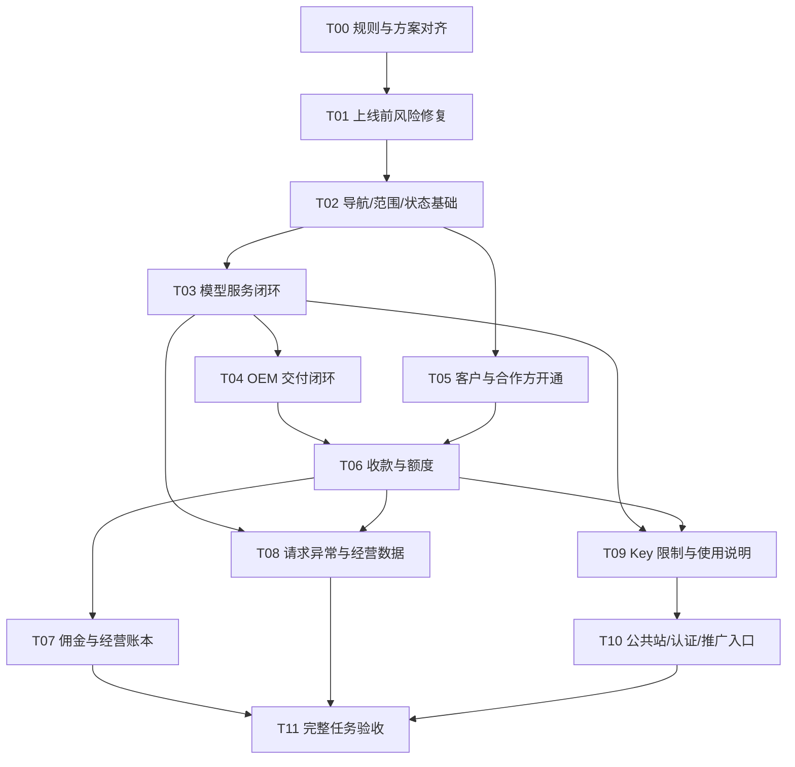

# sol 整改执行任务书：按完整业务任务交付

状态：**已按用户反馈修订，供后续 sol 实施**。日期：2026-10-09。审查基线：`release/v0.1.0@64e1825`。  
配套设计：[产品流程与交互整改方案](18-产品流程与交互整改方案.md)、[API Key 与模型使用说明设计](20-API-Key与模型使用说明设计.md)。本轮产物为文档修订，尚未启动实现或部署。

## 2026-10-10 实施补充（最新业务决定）

本轮已获授权开始实施；实现与验证状态以 [整改实施记录](21-整改实施记录.md) 为准。历史“仅文档、尚未启动”描述只表示审查阶段。

普通用户是在标准 API 中转站账户上增加邀请能力。专属邀请码/链接、已邀请人数、赠送积分、分佣资格取得方法及达线进度、个人推广所得佣金全部集中在同一账户的“邀请与收益”。每名注册用户均可邀请；有资格后展示真实佣金和结算，不需要另开推广账户或独立后台。旧 `/partner` 能力迁入有权收益视图，普通用户登录仍进入 `/app`；管理岗位按原权限进入工作区。邀请两跳、API 消费计佣、充值不计佣、赠送积分与佣金钱包隔离均不改变。

验收补充：无资格的新用户可复制本人邀请码/链接、查看已邀请人数与赠送积分及达线进度；取得资格后在同一“邀请与收益”查看个人佣金和结算；本人信息与专业推广客户范围仍由服务端隔离，无另建账户、权限自选或额外开户流程。

## 1. 实施者必须先读的约束

用户已确认：只使用平台、OEM、渠道三个名称；平台/OEM 优先，平台协助 OEM 配置到可营业再交接；同品牌统一终端价，渠道不成为资金主体；线下记账不强制专业票据；普通用户先生成 Key 并设置模型范围、USD 上限、有效期，再按需阅读 Agent 配置或模型调用协议；普通用户不能指定上游和路由。

整个项目允许按业务目标大改或重构，不以保留原架构、URL、组件、菜单或旧规范为前提。用户没有逐项阅读全部章节；实施者应落实已确认方向，自主解决合理的产品与技术细节，不将每个页面改动都退回要求用户确认。

实施的完成标准是任务能闭环，不能只完成菜单改名、删除说明、套一层向导或换视觉样式。代码领域可以继续分开，页面必须能带着对象、范围和状态完成下一步。

开始任何文件修改前按 [AGENTS.md](../AGENTS.md) 同步当前分支与 `origin/release/v0.1.0`。本任务书记录的是审查时基线，实施时重新核对变化，不能依赖旧行号或覆盖其他人的修改。遵守已有 PR 合并方式。

以下改动不在本方案内：改变计佣算法、允许渠道收款/采购、自动打款或追回、用新策略重算历史、放宽服务端权限、删除财务事实、向用户或员工发真实邀请消息、真实支付/计费探测、部署。需要这些动作时应独立说明具体理由和授权范围。

### 1.1 优先复用已经正确的能力

| 已有能力 | 复用要求 |
| --- | --- |
| 品牌价格继承 | `backend/internal/catalog/price.go` 的渠道继承品牌价格规则要保护，旧文档纠正不等于重写它 |
| 线下收款与订单 | 保留客户选择、实收/额度分离、原支付主体/来源池、事务发放与履约恢复 |
| Key 创建与验证 | 复用掩码/复制审计和可选测试；表单突出模型、USD 上限、有效期，RPM/并发归高级项，示例改按用户选定模型生成 |
| 钱包报价与未知结果保护 | 保留金额/支付方式绑定、报价过期防护、稳定幂等和订单回查 |
| 消费退款预览 | 保留不同资金/权益来源、不可退款部分、佣金影响的核对 |
| 佣金结算/追回/重算 | 保留原快照、状态限制、部分实际收回、操作/业务单据去重和事务一致性；外部票据非必填 |
| 员工权限 | 保留公司范围、岗位并集、最后管理员保护、变更即时生效和审计 |
| 异步媒体与列表资源状态 | 保留真实任务状态、加载/陈旧数据区分，改位置不退化错误处理 |
| DESIGN.md 视觉基础 | 可复用有效基础，也可为合理简单的体验重构；不能因旧视觉规范保留繁琐流程 |

## 2. 推荐交付单元与依赖

每个单元可以拆成多个可审查 PR，但必须以完成一个可演示任务收口。不要在同一个 PR 同时重写账务、导航和整个公共站。下列顺序先服务平台与 OEM；“依赖”不是要求先建庞大通用平台。



启动实现后，T01 中无依赖的风险修复可先独立落地。不要为了等待公共站完成而推迟平台/OEM 验收，也不要把后续波次标成已完成。

### T00：统一规则与实施基线

**结果**：本轮确认的业务和新的任务架构成为一致的设计依据，旧规范不再把实现拉回原体验。

- 对齐 docs/03、05、06、12、13、14、15、17、两份 docs/16、DESIGN.md 和文档索引，按主方案 17.1 逐项更新；在进度文档区分“业务决定”“实现完成”“验证通过”。
- 清理所有业务界面的旧字母分类：导航、表单、帮助、通知、错误、导出、种子显示名、测试断言、文档与生成契约一致更新。历史代码映射仅在技术迁移说明保留：`A → platform（平台）`、`C → oem（OEM）`、`B → channel（渠道）`。若重命名数据库枚举/接口字段，做完整迁移和测试；不能只替换数据库值而漏掉服务端分支。
- “渠道”专指推广组织，不再笼统代称 OEM 和平台。后台若仍共用 channel_org 等内部实体，使用适配/展示名称消除用户歧义；内部沿用字段不是保留旧产品叫法的理由。
- 保留价格、收款主体、佣金、冲正、权限规则。逐渠道终端客户价已被排除；不要删除品牌级 OEM 定价。
- 查找所有旧规则文案与测试断言，建立删除/替换清单：OEM→渠道池划拨、渠道商户、OEM 平台审核、固定 KOL 层级、演示 ID、外部内容快照、万能“操作成功”。
- 对接下来每个 PR 标明覆盖 F 编号、新增/复用的接口和测试场景；未完成的问题继续保留，不把文字变化当关闭依据。

**验收**：不存在互相矛盾的权威定价/资金职责描述；用户界面不出现旧字母叫法；实现者能从单一入口找到流程、权限和验收要求。对应 F28、F29、F30、G30。

### T01：消除错误事实与重复提交风险

**结果**：现有页面不会以假默认值、未知即正常、演示金额或误导动作造成错误操作。

**主要落点**：`web/app/admin/commission/page.tsx`、`web/lib/dashboard.ts`、`web/app/channel/page.tsx`、`web/app/channel/ledger-panel.tsx`、`web/app/admin/billing/supplier-panel.tsx`、`web/app/admin/reconciliation/page.tsx`、`web/app/storefront.tsx`、`web/app/login/page.tsx`、相关文案/测试。

1. 策略与资格配置自动读取，加载失败不提供可保存默认值；编辑基于实际版本，百分比转换集中实现。
2. 健康状态在无成功检查时为未知/失败；不默认为 READY。初始数字不假装当前数据。
3. 渠道首页移除无权任务，旧额度/佣金混合入口按真实对象处理。
4. 供应商支出建立同一操作的稳定幂等身份，提交超时可查/可重试原操作；确认成功后才创建下一操作。补必要后端查询支持时，先验证既有接口是否可复用。
5. 待对账动作明确作废及释放影响；统一列表与详情查询失效。公共套餐按真实周期展示；停止公共页演示结账支路。
6. GitHub 未实现入口隐藏；开发种子与生产 UI 脱钩。

**验收**：G01、G02、G03、G05、G10、G24。重点对应 F02、F03、F11、F14、F15、F17、F20、F21、F22。不以“加提示风险”替代修复。

### T02：角色导航、范围与通用状态

**结果**：所有任务入口使用一致权限；跨页保留范围与对象；通用组件不制造新的断点。

**主要落点**：`web/lib/nav.ts`、`web/lib/rbac.ts`、`web/lib/console-home.ts`、`web/components/layout/console-shell.tsx`、`web/app/admin/shell.tsx`、`web/app/admin/list-panel.tsx`、`web/components/console/*`、`web/app/channel/management-panels.tsx`。

- 按主方案第 5 节独立声明平台、OEM、渠道、用户/推广视图，菜单、首页快捷入口、对象动作使用共同能力判断。后端独立鉴权继续保留。
- 明确“当前经营品牌”与“统计归属筛选”是两个概念；URL、query key 和接口参数使用同一范围。切换时丢弃不适用的选中对象与草稿，阻止陈旧响应覆盖。
- 实现页标题/面包屑、对象链接、通用列表的分页搜索/空态/错误/回程；按实际列定义宽度。不要将所有领域参数塞入一个万能 ListPanel。
- 统一提交结果：成功、失败、结果未知、成功后回读失败。短表单原位错误、焦点恢复、未提交草稿提示。
- 组织安全与个人安全入口分离；未完成能力不进导航。多角色登录落点保留明确 next，其次选择或记住有权角色工作区。

**验收**：G01、G04、G06、G19、G20、G21。对应 F01、F03、F24、F25、F26、F27。

### T03：模型服务端到端闭环

**结果**：技术人员可以从一个模型开始，补齐提供商账户、上游成本、公开能力/价格、路由与授权，明确知道是否可调用。

**主要落点**：`web/app/admin/providers/**`、`web/app/admin/models/**`、`web/app/admin/routes/**`、`web/app/admin/channels/models-panel.tsx`、`web/app/channel/models.tsx`、`backend/internal/catalog/{readiness,price,provider_models,route}.go`、`backend/internal/app/*catalog*` 及实际路由注册处。

- 提供商详情改为连接/账户优先；上游发现、成本编辑、使用该上游的路由形成上下文链接。
- 模型详情按状态给出下一步。已有路由进入原路由，无路由才能新建；缺价等修复入口带回原对象与草稿。
- 新增或扩展服务端只读就绪投影，返回具体缺项和可见动作，而不是前端用几份列表是否为空猜“可用”。配置就绪与运行健康分开。
- 授权支持搜索、差异预览、当前上级能力校验；价格单位按类型显示。维护统一品牌售价，保护历史快照。
- 读权限与写权限分开；没有编辑权的岗位仍能读取其有权对象，不用 `IfCan(write)` 把整个只读详情隐藏。

**验收**：G07、G08、G09、G14、G22。对应 F06、F07、F08、F28。真实验证必须显式执行，不能保存配置时偷偷发计费请求。

### T04：OEM 可恢复交付与工作台

**结果**：平台创建的是一份能交付到营业的 OEM 任务，接手人知道剩余事项并能实际登录经营。

**主要落点**：`web/app/admin/channels/{page,create-dialogs}.tsx`、`web/app/admin/channels/[id]/page.tsx`、`web/app/admin/channels/{admins-panel,payment-readiness,quota-panel,models-panel}.tsx`、`web/app/admin/brands/page.tsx`、品牌/域名/身份/支付相关服务、新增交付投影与最小流程记录。

- 新增“开通 OEM”入口与交付详情，品牌可内联创建/选择，取消手输品牌 ID；创建后直接进入该对象。
- 保存各步骤引用、流程阶段与交接证据。对象创建幂等；跨领域分步成功不是一次虚构大事务，部分失败可恢复。
- 主方案 7.2 的必需项由后端事实驱动并自动检查；在线与线下营业方式的必需项不同。方案内未启用的套餐/支付方式不强制阻塞。不增加逐项签字、多级审批或复杂交付工单，已有有效配置与验证结果直接复用。
- 页面显示责任角色与“继续”入口，支付配置属于 OEM 的步骤交给 OEM 有权人完成，不赋予平台跨品牌资金权。
- 区分交付阶段与当前营业能力；已交接后能力变坏进入工作台异常，不抹历史。
- 平台/OEM 工作台优先显示本角色可处理事项，各计数可以进入同范围列表。

**验收**：G04、G07、G11、G12、G14、G18、G23。对应 F04、F05、F08、F17。完成交接前需接手人登录验收；不创建或代管他人密码。

### T05：客户详情、渠道开通与推广关系

**结果**：客服/运营通过可识别客户处理问题；渠道开通后只有有效的业务入口。

**主要落点**：`web/app/admin/users/page.tsx`、`web/app/channel/users-panel.tsx`、`web/app/channel/subchannels/**`、`web/app/admin/channels/**`、`web/app/admin/promos/page.tsx`、`web/app/channel/attribution/**`、`web/app/partner/partner-board.tsx`、用户/关系查询接口。

- 新增客户详情与权限投影，聚合订单、额度、请求、推广、审计的链接；按现有权限返回可见字段，不把不同角色都喂同一份敏感数据。
- 列表使用服务端搜索/分页，支持从客户详情预填入账对象、从请求定位消费冲正。
- 渠道创建后进入开通详情；品牌继承且不可改，无资金步骤。管理员选择与注册交接有可操作入口。
- 关系选择器替代原始 ID 和固定旧层级；邀请关系与两跳计佣分别呈现。
- 渠道“我的佣金”使用真实佣金/结算记录，发放数据进入平台/OEM 资金流水。

**验收**：G01、G06、G08、G13、G19、G22。对应 F05、F09、F12、F13、F24、F29。

### T06：统一收款、额度与订单详情

**结果**：从客户付款到额度可用、再到退款/异常恢复有一条可查询的完整链。

**主要落点**：`web/app/admin/payments/**`、`web/app/channel/payments/**`、`web/app/console/wallet-panel.tsx`、`web/app/console/plans-panel.tsx`、`web/app/console/entitlements-panel.tsx`、`web/app/storefront.tsx`、品牌支付与订单/履约服务。

- 共用有范围的收款入口与订单详情，区别实际付款与额度履约状态，展示原主体/原池。
- 线下发放保留现有强项，补充 OEM 池预览、操作结果链接与返回客户；确认前核验池和客户状态。
- 收款、支出、打款、追回按主方案 10.0 统一为轻量留痕。外部 reference/票据/附件可选，系统生成内部记录号；前端、API、数据库的必填/唯一约束一起核对。幂等依靠操作身份和业务单据，不依赖随手写的备注，也不能伪造一个外部凭证号满足旧校验。
- 公共站、钱包、套餐共用正式报价与收银台，不保留固定 1 USD 或固定 Stripe 分支。
- 完成/关闭/失败后可以从订单回查，回到原 Key/模型说明或购买入口。已付未发放只恢复原履约，不再收费。
- 退款动作显示实际现金与额度影响；消费冲正继续使用已有预览，不混入支付退款。

**验收**：G10、G11、G12、G14、G15、G16、G18、G24、G28。对应 F11、F13、F20、F21、F30。

### T07：佣金日常结算与经营账本

**结果**：财务以结算单/追回记录为对象工作，低频策略不压过日常待办。

**主要落点**：`web/app/admin/commission/**`、`web/app/channel/{rules-panel,settlements-panel,management-panels,ledger-panel}.tsx`、`web/app/admin/billing/supplier-panel.tsx`、`backend/internal/commission/**`、相关追回与账本服务。

- 实现待结算/待登记打款/待收回/全部/规则视图；策略自动加载与版本比较，百分比展示。
- 生成结算预览包括范围、账期、笔数、人数、总额和排除项；最终提交再次校验，不信任前端预览结果。
- 结算单抽屉中登记真实线下打款；只需核对对象、金额、时间，说明/参考号可选。追回记录展示部分收回、剩余及系统留痕，有补充材料则展示；没有专业票据也可完成。动作完成同步更新关联对象。
- 支出登记与冲正具备原记录、理由、稳定幂等；空金额不使用演示值。
- 保留冻结、暂停、撤销、冲正、已支付等全部原状态含义；消费与策略快照不能被新 UI 覆盖。

**验收**：G02、G05、G10、G16、G17、G22、G28。对应 F02、F09、F10、F11、F13。

### T08：异常处理、请求详情与可信汇总

**结果**：从问题到原请求/订单到正确处置能在关联上下文内完成；经营数字来自完整统计范围。

**主要落点**：`web/app/admin/{reconciliation,usage,alerts,runbooks,metrics,margin,media}/**`、对应 channel 页面、`web/lib/dashboard.ts`、用量统计/账务待对账/请求与 attempts 服务。

- 异常队列按请求、订单/履约、服务分组，默认未解决；同一异常在工作台与详情使用同一身份。
- 新增请求详情投影，串起尝试、预授权、实际消费、冲正和佣金引用；返回按角色脱敏的字段与可执行动作。
- 动作就地预填原对象；缺真实用量不可估算收费；结果未知不自动再次请求模型。
- 统一列表/详情/计数的缓存与回读状态，批量动作逐项校验；保留范围与返回位置。
- 周期报表使用服务端聚合，完整时间范围、状态口径和时区一致；未知/失败/陈旧不转零。毛利与经营盈亏明确区分。

**验收**：G03、G05、G06、G15、G18、G19、G23。对应 F14、F15、F16、F17、F24。

### T09：Key 限制与两类模型使用说明

**结果**：用户先生成并管理 Key，不需要选择 Agent 或完成向导；需要时直接找到匹配模型的 Agent 配置或调用协议。

**主要落点**：`web/components/console/overview-hero.tsx`、`web/lib/{overview-guide,key-example,model-use}.ts`、`web/app/console/{keys-panel,examples-panel,wallet-panel}.tsx`、`backend/internal/identity/apikey.go`、`backend/internal/app/gateway_http.go`、账务预授权/结算与媒体请求链、`backend/internal/app/docs_examples.go`。详细规则以 docs/20 为准。

- API Key 恢复为一级入口。创建/编辑表单直接呈现所有/指定模型、USD 总消耗上限、有效期；RPM/并发才是折叠高级项。创建不要求充值、不产生请求费用。
- 后端补齐显式模型范围、限额、有效期保存与修改；模型权限查询失败必须拒绝调用，不能误当“所有模型”。Key 创建及策略写入保持原子性，防止只生成了秘密却丢失限制。
- USD 限额接入原子预授权、实际结算、失败释放、未知结果、冲正和异步媒体；轮换不清零用量，账户充值不改变 Key 上限。实现时不得用入口处非原子查询冒充预算控制。
- 普通用户 Key 的公开请求禁止指定 provider/routing 等内部策略；移除 `provider.only/ignore/order` 对普通调用的作用并明确拒绝不支持参数。诊断/测试/灰度能力单独限制到平台内部角色与入口，不能借其他协议绕过。
- 模型详情新增 Agent 配置/调用协议标签，Key 使用说明带入允许模型，模型页面也可独立阅读。使用真实品牌地址、公开模型 ID 与准确协议；从现有代码片段迁移时验证版本、地址拼接、流式与工具调用。
- 首期用少量模板和现有目录数据，不建设强制引导状态机或复杂教程 CMS。URL 只保存 Key ID、模型和说明标签，秘密不落 URL/通用草稿；充值返回原说明。
- 站内测试可选且显式计费。失败按 Key 状态、Key USD 上限、账户余额、模型权限、频率/并发、参数与服务错误分别恢复，不让用户选择上游排错。
- 保留用户用量/请求和额度/订单/套餐的清楚分组；网页试用、媒体工具为辅助入口。

**验收**：G07、G09、G18、G20、G21、G25、G26、G27、G29。对应 F18、F19、F24、F27、F31、F32。USD 限额和禁止用户选路由是服务端行为，不能以改 UI 完成验收。

### T10：公共站、认证与推广入口收口

**结果**：未登录访问者看到真实能力；开始接入、购买或推广后不会在登录时丢失任务。

**主要落点**：`web/app/page.tsx`、`web/app/storefront.tsx`、`web/lib/site-content.ts`、公共路由、`web/app/login/**`、`web/components/layout/console-entry.tsx`、`web/app/partner/**`、`web/app/console/referral/**`。

- 删除未验证的外部排行、演示促销和重复公共功能页；保留真实模型目录、协议文档、OEM 合作和法律/信任信息。
- 正确传递品牌上下文与 next，保留有效推广归属和购买/模型意图，禁止开放重定向。
- 登录方式与实际服务配置一致；多身份只展示有权门户。不能把用户的后台角色写成可自选的新权限。
- 推广者信息整合到邀请与收益；兼容旧地址但不拓宽可看客户范围。
- Base URL 校验进入 OEM/官方品牌交付配置和展示链，不靠首页硬编码补救。

**验收**：G01、G04、G14、G20、G24、G25。对应 F20、F21、F22、F23、F27、F29。

### T11：按任务验收、清除旧说明与交付记录

**结果**：全部关键任务在指定角色下可完成，批准的改动有证据和明确剩余项。

- 对照主方案第 15 节逐条处理文案，检查中英文；必要的费用、期限、后果与错误原因不得误删。
- 完整执行第 4 节矩阵，结合真实服务集成测试与浏览器任务测试。mock 通过不能代替品牌隔离与资金一致性验证。
- 采集关键成功/失败/窄屏状态截图，记录任务、角色、预置条件、提交版本、实际结果及未通过原因。
- 按主方案 16.3 安排初用者测试；未获得测试者时明确标“待用户可用性测试”，不得宣称产品体验已被真实用户验证。
- 更新文档和实施状态，所有保留别名/删除路由有清单；构建成功之外还要检查旧入口不会落回旧错误流程。

## 3. 接口与状态支持：缺什么补什么

下表为**建议能力契约，不是声称当前已有的 API**。实施者先盘点现有端点与生成客户端；能复用则复用。新接口遵循仓库当前契约与授权方式，不在文档阶段固定未经验证的 URL。

| 能力 | 最小输入/输出 | 后端责任 | 前端禁止替代 |
| --- | --- | --- | --- |
| 模型就绪投影 | 对象/范围；检查项、状态、原因码、检查时间、可见动作 | 汇总真实目录/路由/授权/账户事实，区分静态与运行健康 | 用列表非空或 `active` 猜整体可调用 |
| OEM 交付记录 | OEM/品牌引用、阶段、必需项、责任角色、交接证据、版本 | 分步保存、对象幂等、权限验证；实时就绪另算 | 单个 localStorage 百分比充当已交付 |
| 工作台队列 | 角色范围、时间、类型；对象、状态、计数、链接所需标识、更新时间 | 与详情使用同一条件，失败不返回伪零 | 拼不同范围的最新 100 条来估总数 |
| 客户/请求/订单详情 | 可授权对象 ID；关联事实、状态、可执行动作 | 每个字段与关联对象都按主体与权限裁剪 | 先给全量敏感对象再由 UI 隐藏 |
| 周期聚合 | 起止、时区、品牌/渠道、状态等；总量、维度与完整范围 | 定义金额/请求/退款口径，分页独立 | 客户端过滤样本来画“本月总量” |
| 结算/风险预览 | 操作对象/范围、拟修改值；影响、排除项、版本 | 最终提交事务内复核并发变化 | 将预览当成无需校验的授权凭据 |
| 未知结果查询 | 原操作 ID/幂等键；确定成功、失败或仍在确认 | 同一操作身份可重试，参数冲突拒绝 | 每次点击创建新幂等键 |
| Key 限制与用量 | 显式模型模式/集合、USD 上限、有效期、版本；已用/占用/剩余/状态 | 权限与预算原子校验，结算释放/冲正可追溯，拒绝内部路由控制 | 只加前端输入框、查询失败当不限、轮换清零 |
| 模型使用说明 | 品牌、模型、Key ID、Agent/协议标签；匹配配置与代码、请求链接 | 真实能力与地址一致；秘密只按原有安全机制读取 | 强制完成教程、读文档自动发请求、携带上游控制参数 |
| 线下操作留痕 | 对象、金额、币种、时间、可选说明；操作 ID、内部记录号 | 原子业务处理与幂等，操作者自动留痕，外部票据可选 | 强制专业凭证、备注唯一、自动编号冒充外部付款证据 |

状态统一词典需区分领域状态、显示名和可行动作，不把不同领域的 `pending` 强行当一个业务状态。时间以服务端事实为准。分页、批量预览、导出若需要 snapshot/cursor，必须保证可重复核对；“生成了一个 report 页面”不等于已有审计证据。

## 4. 验收场景矩阵

下面场景是必须验证的行为，不要求按相同粒度机械增加单元测试。纯版式修改做视觉/键盘检查；涉及资金、权限、并发和恢复的变化必须有有意义的自动化回归。

| ID | 角色 / 前置条件 | 操作与故障注入 | 必须观察到的结果 |
| --- | --- | --- | --- |
| G01 | 平台、OEM、渠道、普通用户、审计角色 | 分别打开首页/菜单/快捷入口/对应深链 | 可见入口不通往固定无权页；深链无权时拒绝；渠道无资金职责 |
| G02 | 有已有策略的财务，实际总比例与旧默认不同 | 慢网/读取失败/修改时他人更新策略 | 未读成功不能保存；不显示假当前值；版本冲突可辨认；旧佣金不被改写 |
| G03 | 工作台和模型状态 | 健康/汇总接口 500、超时或返回缺项 | 未知/失败与正常/零不同；部分模块仍可用 |
| G04 | 多身份账户与受限 OEM 员工 | next 登录、返回原任务、切品牌/渠道、权限撤销 | 有权目标恢复；不能开放重定向、串范围缓存或继续旧权限提交 |
| G05 | 多条待对账请求与余额占用 | 单条作废、批量部分冲突、提交后列表回读失败 | 明确释放后果；只处理可处理项；无估算扣费；结果/列表/计数最终一致 |
| G06 | 150+ 客户/订单/请求，分不同渠道 | 搜索第 120 条、翻页、进详情、返回/刷新 | 服务端能检索；条件与范围保留；不是最新 100 条的本地过滤 |
| G07 | 无账户/无成本/无路由/无授权的模型 | 从缺项进入修复，保存后返回；已有路由再次打开 | 保留对象与草稿；已有路由不重复创建；未就绪不错误显示可用 |
| G08 | 平台直属渠道、OEM、OEM 下渠道，存在撤权 | 交叉授权、OEM 授权自身已下架模型、渠道尝试上架 | 有效范围严格校验；正确解释阻塞；无越权新调用 |
| G09 | 同品牌两个渠道和直属用户，不同 OEM | 查看价目、预授权、消费快照，随后修改品牌价 | 同品牌终端价一致；不同品牌隔离；历史请求按旧快照 |
| G10 | 支出/发放/订单创建 | 服务端成功但客户端断网，再原操作重试/刷新 | 单次记账或发放；原操作可查询；参数改变不能冒充原重试 |
| G11 | OEM 池足够/不足/并发减少，OEM 下渠道用户 | 线下收款并发放，预览后余额变化 | 固定 OEM 主体与池；最终原子校验；不足时不出现半成功记录 |
| G12 | 两个不同品牌的订单 | 平台操作 OEM 订单、OEM 操作另一 OEM、渠道尝试收款/退款 | 服务端拒绝；UI 无错误入口；订单仍保存原主体/原池 |
| G13 | 客户/渠道管理员交接 | 选错归属、角色冲突、撤销旧管理员、接手登录 | 原保护有效；不改归属/密码；新旧权限按事实立即生效 |
| G14 | 同品牌正式域名与测试配置 | 公共模型、报价、结账、SDK 示例，API Base URL 缺失/错误 | 品牌全链路一致；错误地址不可当正常示例复制；不泄露上游地址 |
| G15 | 已付未发放订单、已消费待退款请求 | 关闭返回支付页、重复回调、消费冲正 | 不再次付款/发放；现金退款与消费额度冲正清晰分开 |
| G16 | 冻结/可结算/已结算/已支付佣金 | 原消费退款、按原快照核对、重算 | 仅允许状态按原规则处理；未付撤销/重建清楚；已付进入待收回，不自动扣余额 |
| G17 | 已打款后待收回记录 | 部分收回、同一操作重试、并发超额、全部结清后再提交 | 剩余正确；重复记账/超额拒绝；原钱包不自动抵扣；内部记录可追溯，不要求正式票据 |
| G18 | 接入、交付、订单、媒体异步任务 | 刷新/退出/重新登录/超时，选择对象后旧请求才返回 | 正确恢复步骤；未知结果不重建；旧响应不能污染新对象 |
| G19 | 客户、佣金、经营报表 | 切品牌/日期/时区；部分接口失败；退款与冲正混合数据 | 完整周期统计；毛利/盈亏分开；小额不被误显示为零 |
| G20 | 无 Key/无余额的新用户 | 直接创建 Key，设置模型范围/USD 上限/有效期，再按需阅读 Agent 配置或调用协议 | 三项限制清楚可见；无余额也能创建/读说明；不强制选工具或完成教程；充值返回保留上下文 |
| G21 | 任意关键任务 | 1440/1024/390 宽度，键盘 Tab/Enter/Esc，屏幕阅读标签 | 对象/金额/动作可识别；焦点可达并恢复；按钮非仅颜色提示 |
| G22 | 只读审计、OEM 运营、OEM 财务、渠道 | 查看客户/请求/佣金详情以及更改字段 | 有权读取不因无写权限消失；敏感字段/秘密不越权；多岗位并集正确 |
| G23 | OEM 配置中/已交接 | 中途失败恢复；交接后域名/支付/模型失效 | 流程状态与实时能力分开；新异常进队列；历史交接记录保留 |
| G24 | 一次/月/季/年套餐与多种真实支付方式 | 公共价格卡到购买，报价变化/无可用方式 | 周期/币种/续费/权益准确；无固定 Stripe 或演示 1 USD 支路 |
| G25 | 新用户带推广码及模型/购买意图 | 注册/登录/OAuth 成功或失败后返回 | 归属不丢，合法 next 保留；不能伪造角色；公共入口只展示实际支持能力 |
| G26 | 选定工具/协议/模型/Key | Key 无效/过期、模型无权、Key 上限不足、账户余额不足、限流、参数错误、超时，以及平台测试成功 | 错误指向正确的 Key/账户/模型恢复动作；平台测试成功不冒充外部工具接通；成功有本人请求证据 |
| G27 | 有限额/无限额、指定/全部模型、有效/过期 Key | 并发、流式/媒体、失败/未知、重复结算、冲正、轮换、编辑、目录撤权、策略读取失败 | 预算原子占用/结算/释放，充值或轮换不清零；到期拒绝新请求；策略失败不放宽权限；保存限制原子完成 |
| G28 | 线下收款、打款、追回 | 不填外部参考号/附件；不同交易使用相同备注；同一操作超时重试；提供真实交易号时重复登记 | 最少事实即可完成；不同交易不因备注相同被误拒；同一操作只记一次；有可靠交易号时按业务范围防重 |
| G29 | 普通 Key 与平台内部有权诊断 | 在 Chat/Messages/Responses/媒体等所有公开入口传 provider.only/ignore/order、等效参数或诊断头 | 普通调用无法影响上游选择或内部测试策略，明确拒绝不支持的控制参数；内部诊断经过独立鉴权 |
| G30 | 平台/OEM/渠道/普通用户入口 | 检查菜单、表单、错误、导出、示例、帮助和改动文档 | 用户可见组织称谓统一，无旧字母角色或把 OEM 混称渠道；内部兼容映射与权限一致 |

### 4.1 使用现有测试而非重写同一断言

前端测试基线在 `web/e2e` 和相邻 `*.test.tsx`；优先扩展 `model-delegation`、`oem-console`、`payment-journey`、`settlement-journey`、`recovery-journey`、`charge-refund`、`staff`、`console-entry`、`rbac` 等任务测试。后端已有品牌支付、渠道管理员、模型委托、佣金打款/追回/重算/暂停和员工权限集成测试，必须保护这些不变量。

执行命令以实际改动范围选择；仓库当前入口包括：

```sh
# 在 tokstudio/backend 执行；可先运行本次影响的包，最终集成按仓库要求完成
go test ./...

# 在 tokstudio/web 执行
npm test
npm run build
npm run e2e:web -- <本次任务相关的测试文件>
```

浏览器测试配置读取 `TOKENHUB_WEB_ORIGIN`，可使用 `PLAYWRIGHT_SKIP_WEBSERVER` 指向已准备好的隔离测试服务。先检查种子与服务状态，不能把真实支付/计费环境当测试夹具。涉及外部等待的用例采用受控测试适配器/服务状态，不以点击真实付款替代测试。

本轮只写文档，未执行上述产品测试，也未声称这些测试在新设计下通过。

## 5. 121 个现有路由的处置表

这是处置建议，**不是已存在的新路由清单**。用户允许全项目重构，原路径、组件和页面拆分不是保留义务；实施者可按最终信息架构改名、合并或删除。需要延续的实际链接和业务引用应正确迁移，每个任务保留唯一主入口，不为兼容尚未上线的错误设计增加长期复杂度。

用户源文件位于 `web/app/console`，对外 URL 经 rewrite 使用 `/app`；表中使用对外 URL。动态参数以原页面目录表示。`?tab=` 等为建议中的新页面状态，实施时统一注册、校验和生成链接。

跳转必须保留可用的对象与筛选参数并重新校验权限；不允许把无权旧路由跳到有权新操作。未上线且不存在有效业务能力的页面可删除并返回明确 404/410，不统一跳首页掩盖死链。下表没有要求保留每一个旧导航项。

### 5.1 平台 32 个

| 现有路由 | 处置与目标 |
| --- | --- |
| `/admin` | 重做角色工作台，待办与交付优先 |
| `/admin/alerts` | 归入异常处理；跳 `/admin/exceptions?type=service` |
| `/admin/audit` | 保留能力，归设置/审计；从对象可带筛选跳入 |
| `/admin/billing` | 拆出消费调整与经营支出；订单充值统一去 payments；默认消费调整 |
| `/admin/brands` | 品牌配置进入 OEM 交付或官方品牌设置；保留品牌选择/查找的管理视图 |
| `/admin/channels` | 改为 OEM / 直属渠道分页视图，创建按类型进入完整流程 |
| `/admin/channels/[id]` | 渠道开通/经营详情；OEM 跳到对应 OEM 交付详情 |
| `/admin/commission` | 保留 URL，重做待结算/打款/追回/记录/规则标签 |
| `/admin/keys` | 退出导航并移除无效管理页；现有平台列表接口已返回 410，不恢复跨组织管理用户 Key 的能力。元数据仅在原有权的 OEM/渠道客户详情中展示 |
| `/admin/margin` | 归经营分析毛利标签；与经营盈亏分开 |
| `/admin/media` | 归异常处理/任务查询，详情关联客户与请求 |
| `/admin/metrics` | 归经营分析，用完整服务端汇总 |
| `/admin/models` | 保留，模型任务列表与就绪状态 |
| `/admin/models/[...id]` | 保留，概况/售价/路由/授权/验证详情 |
| `/admin/partners/[id]` | 归客户与合作方中的推广关系详情，不再固定旧层级 |
| `/admin/payments/lanes` | 归设置/官方品牌支付方式；从交付与订单带回程进入 |
| `/admin/payments` | 收款与发放主入口，增加订单详情链接 |
| `/admin/payments/rules` | 归设置/官方品牌结账规则，与实际商户主体一致 |
| `/admin/plans` | 保留，官方品牌套餐，默认在售/草稿而非审核流程 |
| `/admin/prices` | 价格独立入口收口为模型价格视图，不复制编辑表单 |
| `/admin/promos` | 归客户与合作方/推广关系，带对象过滤 |
| `/admin/providers/[id]` | 保留，连接/账户优先，上游与路由关联 |
| `/admin/providers/new` | 保留，支持从模型任务带上下文创建 |
| `/admin/providers` | 保留，模型与套餐下的技术入口 |
| `/admin/reconciliation` | 跳异常处理待对账视图，动作改用准确资金含义 |
| `/admin/routes/[id]` | 保留，实际 ID 或 new 按原约定，检查上下文与重复路由 |
| `/admin/routes` | 保留为技术二级入口；模型详情可直达对象 |
| `/admin/runbooks` | 退出一级导航；内容整合到对应异常的按需帮助 |
| `/admin/settings` | 拆组织设置与技术运维分类，移出个人安全 |
| `/admin/staff` | 保留能力，归设置/员工与权限 |
| `/admin/usage` | 请求/账单查询收口到新请求中心；汇总转经营分析 |
| `/admin/users` | 保留客户列表，增加客户详情 |

新增必要页面：OEM 交付详情、客户详情、请求详情、订单详情、异常中心。技术运维分类可使用设置子页或稳定标签，不强制所有项目再生成一级页面。

### 5.2 现有 OEM/渠道共用路径 30 个

| 现有路由 | 处置与目标 |
| --- | --- |
| `/channel` | 按 OEM/渠道分别呈现经营或推广工作台 |
| `/channel/alerts` | OEM 业务异常队列的一类；渠道不继承 OEM 全量告警 |
| `/channel/attribution` | 推广关系内的归因详情/调整；保留现有权限与原因要求 |
| `/channel/audit` | OEM 品牌与团队下的审计；字段继续裁剪 |
| `/channel/brand` | OEM 品牌与团队/品牌外观；渠道无入口 |
| `/channel/commission` | OEM 佣金结算主入口，规则为次级标签 |
| `/channel/commissions` | OEM 的旧额度发放内容迁到资金流水；渠道引导到真实“我的佣金”，不复用旧数据 |
| `/channel/keys` | 从有权客户详情进入；不向管理员提供客户明文 Key |
| `/channel/ledger` | OEM 经营账本，分支出与服务额度记录；移除创建渠道；渠道禁止 |
| `/channel/margin` | OEM 经营分析毛利视图，不包含平台上游成本 |
| `/channel/media` | 业务任务/异常元数据，关联本范围客户 |
| `/channel/metrics` | OEM 经营分析完整汇总；范围含自己与直属渠道 |
| `/channel/models/[id]` | 模型详情，OEM 可改品牌价，渠道仅本地可操作事项 |
| `/channel/models` | 一级“模型与套餐”的模型视图，渠道为“已授权模型” |
| `/channel/payments/lanes` | OEM 品牌支付设置；渠道无入口 |
| `/channel/payments/orders` | 收口到 payments 订单视图，保留筛选与详情 |
| `/channel/payments` | OEM 收款与额度发放；订单/流水关联客户 |
| `/channel/payments/rules` | OEM 结账规则，与品牌支付设置归组 |
| `/channel/plans` | OEM 品牌套餐创建、预览、发布；渠道无入口 |
| `/channel/promos` | 客户与推广中的推广码/关系，主操作复制有效推广入口 |
| `/channel/reconciliation` | 归业务异常；只给当前角色允许的核对/处置 |
| `/channel/rules` | 跳 OEM 佣金主入口的规则标签；渠道不提供策略编辑 |
| `/channel/runbooks` | 从导航移除，相关帮助进入业务异常详情 |
| `/channel/settings` | OEM 品牌与团队分类；个人安全进入账户菜单 |
| `/channel/settlements` | OEM 跳佣金结算；渠道保留自己的结算只读视图 |
| `/channel/staff` | OEM 品牌与团队/员工；渠道不自动获得此组织管理能力 |
| `/channel/subchannels/[id]` | OEM 直属渠道开通/详情，服务端验证直属关系 |
| `/channel/subchannels` | OEM 客户与推广/直属渠道，创建后进入详情 |
| `/channel/usage` | 当前有权范围的请求/用量，详情可关联客户，原 ID 查询为备用 |
| `/channel/users` | 客户列表与新增详情，OEM/渠道的字段/操作各自裁剪 |

新增必要页面：OEM 的交付进度/验收视图、客户/订单/请求详情；渠道的独立收益视图。无需复制一整套平台技术页。

### 5.3 用户 20 个与推广者 4 个

| 现有路由 | 处置与目标 |
| --- | --- |
| `/app` | 进入 API Key 主视图；无 Key 时直接创建，已有 Key 时显示限制和使用入口 |
| `/app/activity` | 收口到 `/app/usage?tab=requests`，新增请求详情 |
| `/app/catalog` | 模型列表与详情，提供 Agent 配置/调用协议，保持所选 Key 和模型 |
| `/app/docs` | 收口为模型使用说明入口，复用两类模板；保留模型/Key 引用与说明标签 |
| `/app/keys` | 一级 API Key 管理；创建/编辑直接设置模型范围、USD 上限、有效期，与首页使用同一视图 |
| `/app/media` | 辅助工具/媒体任务；不占新用户主线 |
| `/app/plans` | 跳 `/app/wallet?tab=plans`，保留商品选择和返回意图 |
| `/app/playground` | 辅助工具/网页试用，不作为首次接入的默认 CTA |
| `/app/profile` | 归设置/个人资料，与账户设置去重 |
| `/app/reconciliation` | 合并到用量与请求的账单核对视图，不使用平台财务术语 |
| `/app/referral` | 邀请与收益主入口，具备权限时显示推广者专业视图 |
| `/app/settings/apps` | 未完成能力退出导航并移除占位页，不伪装可用 |
| `/app/settings/billing` | 收口到钱包订单/账单视图 |
| `/app/settings/members` | 未完成能力退出导航并移除占位页 |
| `/app/settings` | 账户、安全、个人偏好，使用实际能力 |
| `/app/settings/quotas` | 额度权益到钱包；Key 限速/限制到对应 Key 详情 |
| `/app/settings/team` | 未完成能力退出导航并移除占位页 |
| `/app/settings/webhooks` | 未完成能力退出导航并移除占位页 |
| `/app/usage` | 用量与请求，汇总/请求/必要账单标签，完整周期统计 |
| `/app/wallet` | 额度、充值/套餐、订单/流水；佣金追回信息放邀请与收益并保留必要关联 |
| `/partner` | 有权推广者跳 `/app/referral` 专业概况 |
| `/partner/commissions` | 跳邀请与收益/佣金标签 |
| `/partner/settlements` | 跳邀请与收益/结算标签 |
| `/partner/users` | 跳邀请与收益/推广客户标签，范围不扩大 |

### 5.4 公共站与认证 35 个

| 现有路由 | 处置与目标 |
| --- | --- |
| `/` | 重做真实能力＋接入主线首页 |
| `/awesome-ofox` | 外部品牌内容聚合不属于主产品；下线无真实维护计划的页面 |
| `/best-value` | 合并真实模型目录中的价格/能力筛选，不保留无根据“最值”排名 |
| `/blog/[slug]` | 仅保留自有、准确且可维护的文章；不存在/无权内容正确 404 |
| `/blog` | 有真实文章则次级入口；删除外部快照填充 |
| `/compare` | 只有真实可比较数据时并入模型目录；否则不暴露未完成比较功能 |
| `/desktop` | 现有工具接入说明合并到集成文档；取消以未发布安装包为主题的独立导航 |
| `/docs/changelog` | 保留真实版本更新，不使用外部内容冒充 |
| `/docs/develop` | 合并接入文档中的开发指南，保留合法锚点 |
| `/docs/integrations` | 保留已验证的接入方式，和接入配置生成共用能力来源 |
| `/docs` | 文档入口，先协议/配置/错误处理，再高级主题 |
| `/enter` | 保留角色工作区入口，next 优先且只跳有权目标 |
| `/enterprise` | OEM 合作入口，说明真实交付能力，不再混杂终端工具导航 |
| `/image` | 有真实模型时跳模型目录的图像分类；生成操作进入登录工具 |
| `/leaderboards/apps` | 无可验证站内数据则下线，不保留外部快照排行 |
| `/leaderboards/labs` | 同上 |
| `/leaderboards/models` | 同上；以后有真实数据另立口径，不本轮虚构 |
| `/login/oauth/google` | 保留已配置能力，验证品牌/next/推广意图恢复 |
| `/login` | 只显示可用认证方式，登录后回原任务 |
| `/model-finder/[slug]` | 合并到真实目录的能力筛选，不复制一套静态推荐 |
| `/model-finder` | 合并目录筛选入口 |
| `/models/[...slug]` | 保留真实模型详情，展示当前品牌能力/价格并带入接入流程 |
| `/models` | 公共模型与价格的主要事实入口 |
| `/pricing` | 收口到目录价格视图/真实套餐，按实际周期展示 |
| `/privacy` | 保留，只维护与实际产品一致的内容 |
| `/promo/august` | 清除过期演示促销，未上线无需要保留的活动则下线 |
| `/promo` | 推荐计划的公共说明，开始后进入有权邀请与收益，保留有效来源参数 |
| `/quickstart` | 接入文档/接入流程的短入口，不复制一套过时示例 |
| `/terms` | 保留，真实条款不作为本轮 UX 设计随意改写 |
| `/trust/subprocessors` | 保留准确事实，信息缺失另行核实，不复制外部站声明 |
| `/trust` | 保留真实信任信息，删除不能兑现的技术/经营承诺 |
| `/verify` | 当前为请求回单/账本核验说明，合并到文档与请求详情帮助，不作为独立任务入口 |
| `/vibe-coding` | 归已验证的开发工具接入文档，避免单独营销迷宫 |
| `/video` | 同 image，模型分类与登录工具区分 |
| `/vs/openrouter` | 未完成独立事实核实则下线比较宣传，不照搬外部比较结论 |

“核验后保留”表示实施前需要检查该页面的真实依赖和可用数据，不表示仍需用户回答一个开放式问题。能依据仓库与运行事实判断的由实施者完成；不能验证的宣传默认不进入首发。

## 6. 每个实现单元的交付物

每个单元至少包含：实现变更、相关文档/契约更新、针对风险的验证结果、关键路径截图或可复现步骤、剩余问题。PR 描述先写用户行为前后变化，再给验证证据，不以文件数量或新增组件数量充当价值。

推荐用以下简表记录进度，初始均为“未开始”：

| 单元 | 设计依据 | 实现 | 自动化/集成 | 浏览器任务 | 剩余问题 |
| --- | --- | --- | --- | --- | --- |
| T00–T11（实施时拆成逐行） | 方向已明确，细节按业务落实 | 未开始 | 未执行 | 未执行 | 按 F/G 编号记录 |

放行前必须回答：平台能否交付、OEM 能否营业、渠道是否只有该有的能力、用户是否能接通、钱与权限是否守住、失败是否能恢复。某项受外部条件阻塞时，明确列出条件和已完成部分，不写“全部完成”。

## 7. 后续交给 sol 的提示词

> 现在开始依据 docs/18、19、20 实施产品整改。用户已明确业务方向并允许全项目大改或重构；不要求保留原页面、组件、导航或繁琐流程，也不需要逐页请求审批。先按 AGENTS.md 同步 origin/release/v0.1.0，保护已有工作，再按 T00–T11 依赖分批完成。优先平台运营与 OEM：交付到可营业、客户与收款发放、佣金和异常闭环；之后完成普通用户创建 Key、设置可用模型/USD 消耗上限/有效期，以及按需阅读 Agent 配置或模型调用协议的流程。统一平台/OEM/渠道称谓；普通用户不能选择提供商或路由；线下外部票据、附件和参考号可选，系统独立保证幂等与记录追溯。保护同品牌统一终端价、平台/OEM 收款、渠道无独立资金职责、原账务快照和服务端权限。最新用户决定优先于旧规范冲突条款，在 T00 同步文档，不能借重构改写已确认业务。复用正确实现，修复完整任务，不把整改缩成改菜单/删说明/换皮。每个单元给出可复现的任务演示、对应 G 场景验证及状态；新增实质业务问题再向用户提出具体问题。提交、PR 与部署按当时授权范围执行。

以上供后续启动实施使用；本轮仅修订审查与整改文档，尚未启动 sol 或修改产品代码。
