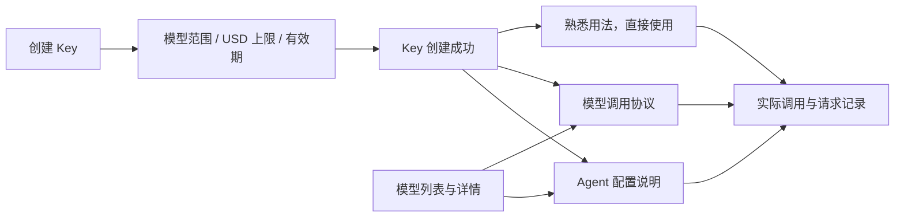

# API Key 与模型使用说明设计

状态：按 2026-10-09 用户反馈细化，尚未实施。配套：[主方案](18-产品流程与交互整改方案.md)、[sol 执行任务书](19-sol整改执行任务书.md)。

**用户先生成 Key，设置可用模型、USD 消耗上限和有效期；再按需要查看所选模型的 Agent 配置说明或调用协议。** 提供商选择、路由、故障切换和灰度策略由平台内部负责。创建 Key、查文档、复制配置均不要求先充值或完成站内测试。

## 2026-10-10 实施补充（最新业务决定）

本轮已获授权开始实施；实现与验证状态以 [整改实施记录](21-整改实施记录.md) 为准。历史“仅文档、尚未启动”描述只表示审查阶段。

普通用户是在标准 API 中转站账户上增加邀请能力。专属邀请码/链接、已邀请人数、赠送积分、分佣资格取得方法及达线进度、个人推广所得佣金全部集中在同一账户的“邀请与收益”。每名注册用户均可邀请；有资格后展示真实佣金和结算，不需要另开推广账户或独立后台。旧 `/partner` 能力迁入有权收益视图，普通用户登录仍进入 `/app`；管理岗位按原权限进入工作区。邀请两跳、API 消费计佣、充值不计佣、赠送积分与佣金钱包隔离均不改变。

验收补充：无资格的新用户可复制本人邀请码/链接、查看已邀请人数与赠送积分及达线进度；取得资格后在同一“邀请与收益”查看个人佣金和结算；本人信息与专业推广客户范围仍由服务端隔离，无另建账户、权限自选或额外开户流程。

## 1. 页面与主流程



这是可选路径，不是必须依次点完的向导。模型目录和使用说明可以在创建 Key 前阅读。一个 Key 可以调用多个获准模型，也可以被用户用于不同应用；建议按用途命名，但不要求“一模型一 Key”。

### 1.1 API Key 列表

主要列：名称、掩码、状态、可用模型、USD 已用/上限、有效期、最近使用。处理中占用在额度单元格的补充信息或详情显示，避免用户将占用当作已扣费。

行操作：复制 Key、使用说明、编辑限制、查看请求；更多操作放启用/停用、轮换。停用可恢复，轮换替换秘密但保持同一逻辑 Key 的用量和限制，不能轮换一次就把预算清零。原 Key 的历史请求仍可查。

从列表点击“使用说明”进入当前 Key 的模型选择，可搜索其有权模型，然后打开模型详情的 Agent 配置或调用协议。已有选定模型时直接带入，不重复询问。完整 Key 不出现在列表默认状态、URL、公共静态文档、分析事件或配置截图中。

### 1.2 创建与编辑表单

```text
创建 API Key

名称            [例如：工作 Agent                ]

可用模型        (●) 所有可用模型   ( ) 指定模型
                指定时显示：搜索 + 多选

USD 消耗上限    (●) 不设单独上限   ( ) 设置总上限
                设置时显示：[       ] USD

有效期          (●) 长期有效       ( ) 指定到期时间
                指定时显示：日期、时间、时区

高级限制 ▾      RPM / 并发

                                      [取消] [创建 Key]
```

推荐初始值为所有可用模型、不设单独上限、长期有效，三项始终可见；不预填会带来意外业务承诺的金额。用户切换“指定模型”后必须至少选一个，切换“设置总上限”后必须填有效金额。没有可用模型可以创建“所有可用模型”Key，但明确显示当前可调用数量为 0。

创建成功：显示 Key 与三个限制摘要，提供复制、Agent 配置、代码调用，不自动发送计费请求。可直接关闭弹窗；之后从列表仍可找回使用说明。密钥查看/复制机制按现有安全能力实施，不在本次流程中额外要求用户重建账号或项目。

编辑使用同一表单，并显示当前已用与处理中占用。普通限制调整一次保存即可；停用、轮换等可能中断既有调用的动作在提交处说明影响。不要每改一个字段都弹一次确认。

## 2. 三项核心限制的准确含义

### 2.1 模型范围

- “所有可用模型”：该 Key 可用范围随账户与所属品牌的实际授权变化；新增可用模型自动纳入，被撤权/下架模型立即不再接受新请求。
- “指定模型”：只允许指定公开模型 ID 与当前账户有权模型的交集。指定名单不因目录增加新模型而扩张，也不能越过平台/OEM 授权。
- 两种模式必须显式保存，不能把“指定但全删掉”误当“不限制”。保留被下架的已选项并标明不可用，用户可删除；不静默换成另一模型。
- Key 只限制模型，不附带上游供应商、成本通道、路由或品牌切换能力。

### 2.2 USD 消耗上限

首期采用**该逻辑 Key 的累计总消耗上限**，不做日/月重置。页面标签明确“USD 消耗上限”，避免误解为给 Key 充值。

| 项目 | 规则 |
| --- | --- |
| 消耗口径 | 该 Key 请求按用户所在品牌终端价计量的 USD API 消费；不是平台供应商成本，也不是佣金 |
| 赠送/套餐抵扣 | 同样计入本 Key 的 API 消耗量；支付来源不绕过限制。原请求消费冲正则按实际冲回部分恢复 Key 剩余限额 |
| 账户与 Key | 账户承担费用，Key 只是限制。创建或提高 Key 上限不增加账户余额，也不预先向 Key 转账 |
| 不设单独上限 | 仍受账户额度、模型权限、有效期、频率/并发限制；不能用金额 0 暗示无限 |
| 显示 | 已确认消耗、处理中占用、总上限、可继续使用的剩余分别可辨认；不限时也显示已用 |
| 并发 | 请求进入前原子预留 Key 可用限额；多个并发请求不能同时使用同一份剩余额度 |
| 失败与未知 | 未产生计费的确定失败释放预留；未知/待对账仍保留占用，待原请求确定后处理 |
| 结算 | 按真实使用量结算并释放差额；请求重试、重复回调、媒体轮询不重复扣 Key 限额 |
| 修改 | 新总上限不得低于已确认净消耗＋处理中占用；要立即停止新请求使用“停用”。提高上限从保存后生效，不清零历史 |
| 多 Key | 各 Key 独立控制；账户余额在它们之间共享。不能把各 Key 上限相加当账户持有资金 |

实现限额时要复用账务预授权/结算事实，并为 Key 增加必要的原子预算约束，不能只在网关入口读一次历史汇总后比较。对于流式、媒体等调用，预留应有可执行的计费上界及相应参数控制；有限额 Key 无法安全预留某类调用时，应在接受前返回明确原因，不能静默改成仅提醒的软上限。主售模型必须完成相应预算控制才能宣称支持该限制。发生异常用量差额仍须保留真实账务并停止继续超限调用，不能为让进度条好看而丢掉消费。测试须覆盖边界、并发和异常结算。

### 2.3 有效期与编辑

创建时可设置到期时间，详情和列表显示确切时刻与时区，后端统一存 UTC。到期时拒绝新请求；已经接受的请求继续按原事实完成或核对，不删除请求、账务或占用。

用户可以延长或改为长期有效；显式停用状态不会因为改日期或轮换秘密自动恢复。恢复已过期 Key 要更新有效期并明确显示当前状态。修改模型/额度/有效期针对新请求生效，不能改变已经接受请求的计费快照。

Key 状态区分：可用、已停用、已过期、额度已用完、暂被处理中请求占满。账户余额不足另列为账户状态；模型不可用是所选模型状态。用户应能立即知道要改 Key、充值、换模型还是等待原请求结束。

## 3. 使用说明在产品里的位置

模型详情使用“概览与价格、Agent 配置、调用协议”三个标签。选定 Key 的引用可跨两个说明标签保持，Key 明文不入地址栏。品牌和模型状态来自相同目录/授权事实，不能公共页显示一套地址，登录后又显示另一套。

```text
模型名称                       model-id [复制]
当前品牌价格 / 能力 / 可用状态

[概览与价格] [Agent 配置] [调用协议]

当前 Key：工作 Agent ▾          可调用 / 不在允许范围 / 已过期…
当前说明内容
```

无 Key 的人可以正常阅读公开协议；复制请求示例使用环境变量占位，旁边提供创建 Key。Key 不允许该模型时保留说明阅读能力，提示编辑允许模型或换 Key，不能自动扩大白名单。

## 4. Agent 配置说明的内容与样稿

### 4.1 固定结构

每个 Agent 只需要一份短说明：**在哪设置 → 填哪些字段/复制什么配置 → 选择该模型 → 如何判断成功 → 与当前方式有关的常见错误**。字段值自动采用当前品牌地址和所选模型，不让用户自己拼域名、路径或模型 ID。

| 内容 | 页面规则 |
| --- | --- |
| Agent 名称与适用版本 | 按已验证的接入方式展示；版本差异影响设置路径时分别说明 |
| 所需接口类型 | 根据该 Agent 与模型实际兼容性选定；不出现平台供应商候选列表 |
| 设置位置 | 简短菜单路径或配置文件路径；确需截图时只用真实匹配版本的图片 |
| Base URL | 显示该 Agent 字段真正需要的完整值，是否包含 `/v1` 不让用户猜 |
| 模型 | 所选模型的公开 ID，可复制；未支持该 Agent 的协议/能力时说明具体原因 |
| Key | 当前 Key 的安全复制入口；不自动上传给外部网站或未知集成服务 |
| 配置片段 | GUI 用字段表，文件配置用片段；不同时堆多个不相关语言教程 |
| 成功判断 | 回 Agent 发出请求；站内请求记录可查看状态/花费。无需在平台另做强制验证 |

Agent 的设置中可能把接口类型叫“Provider/模型供应商”。说明中可如实标出第三方字段名，并固定指导选择兼容类型；这不意味着普通用户能选择 TokenHub 的上游供应商。

### 4.2 可直接用于界面的通用说明

以下为支持自定义 OpenAI Chat Completions 兼容接口的 Agent 模板；仅当所选模型与 Agent 确实支持该协议及所需能力时显示。

> **在 Agent 中使用此模型**
>
> 1. 打开 Agent 的模型设置，添加自定义的 OpenAI 兼容接口。
> 2. 填写下面的接口地址、API Key 和模型 ID，保存。
> 3. 在会话或 Agent 的模型选项中选择这个模型，发送一条消息。
>
> 接口地址：`{当前品牌的该 Agent 接口地址}`　[复制]  
> API Key：`{所选 Key 的掩码}`　[复制 Key]  
> 模型 ID：`{所选公开模型 ID}`　[复制]
>
> 出错时，可在“请求记录”查看这次调用。若没有请求记录，先检查地址和 Key；若有失败记录，按具体错误处理。

发布到具体 Agent 页时，把第 1 步替换成已经验证的实际设置路径，并使用对应地址格式；不能把模板中的花括号占位原样交给用户复制。Agent 使用 Responses、Messages 或其他接口时，换用其对应配置模板，而不是套上 Chat 模板。

### 4.3 Dify 类可视化 Agent 的示例

可采用“设置 → 模型供应商/模型接口 → OpenAI 兼容类型 → 添加模型”的说明结构，随后用一张字段表列出模型名称、API Key、接口地址；最后说明在应用的模型选择处启用该模型。具体菜单名称按验证版本写，若工具会自动追加 `/v1` 或路径，则输出相应根地址。

该结构参考 SiliconFlow 官方 Dify 接入页，其自定义模型说明按模型名称、Key、API 地址逐字段配置。这里借鉴内容组织，不把 SiliconFlow 的地址、品牌预设或兼容结论复制为本产品事实。[官方接入示例](https://docs.siliconflow.cn/docs/usercases/use-siliconcloud-in-dify)

## 5. 模型调用协议的内容与样稿

### 5.1 首屏只给能开始调用的内容

顺序为：协议名称 → 方法与完整 URL → 鉴权 → 最小请求 → 响应关键字段。随后按需展开可选参数、流式、工具调用、多模态/异步和错误码。不先展示提供商、路由、回退或计费内部结构。

同一模型支持多个协议时，以当前上下文的协议为默认，可切换查看其确实支持的其他协议。协议选择是代码调用格式，不是上游选择。Model ID 一律是公开模型 ID，不能把上游模型 ID 暴露成让用户自己选择的第二套标识。

### 5.2 示例页面：Chat Completions

页面渲染前把下面的大写业务值替换为当前品牌/模型的数据；示例中的秘密使用环境变量。`TOKENHUB_API_BASE` 是**包含 `/v1` 的 API 基地址**，不是控制台网址。拼接只做一次。

```sh
# 在本地设置：TOKENHUB_API_BASE、TOKENHUB_API_KEY、TOKENHUB_MODEL
# 页面提供品牌 API 基地址与模型 ID 的复制按钮；Key 不写入公共文档。
curl --request POST "${TOKENHUB_API_BASE%/}/chat/completions" \
  --header "Authorization: Bearer ${TOKENHUB_API_KEY}" \
  --header "Content-Type: application/json" \
  --data "{\"model\":\"${TOKENHUB_MODEL}\",\"messages\":[{\"role\":\"user\",\"content\":\"你好\"}],\"max_tokens\":32}"
```

产品的复制功能由序列化器安全生成实际 JSON 与 shell 引用，不能把不受限制的模型名称/用户输入直接插入命令。此处为内容样稿，不是已对运行环境执行过的测试。

同页语言标签提供 Python 和 Node.js 的等价最小例子，不需要为了使用本产品强制安装专有 SDK。下面使用标准 HTTP 能力；支持常见 SDK 时可再提供经验证的 SDK 标签。

```python
import json
import os
import urllib.request

base = os.environ["TOKENHUB_API_BASE"].rstrip("/")
body = json.dumps({
    "model": os.environ["TOKENHUB_MODEL"],
    "messages": [{"role": "user", "content": "你好"}],
    "max_tokens": 32,
}).encode("utf-8")
request = urllib.request.Request(
    base + "/chat/completions",
    data=body,
    headers={
        "Authorization": "Bearer " + os.environ["TOKENHUB_API_KEY"],
        "Content-Type": "application/json",
    },
    method="POST",
)
with urllib.request.urlopen(request, timeout=60) as response:
    result = json.load(response)
print(result["choices"][0]["message"]["content"])
```

```javascript
// 使用带有原生 fetch 的 Node.js 版本；保存为 .mjs 后执行。
const base = process.env.TOKENHUB_API_BASE.replace(/\/$/, "");
const response = await fetch(`${base}/chat/completions`, {
  method: "POST",
  headers: {
    Authorization: `Bearer ${process.env.TOKENHUB_API_KEY}`,
    "Content-Type": "application/json",
  },
  body: JSON.stringify({
    model: process.env.TOKENHUB_MODEL,
    messages: [{ role: "user", content: "你好" }],
    max_tokens: 32,
  }),
  signal: AbortSignal.timeout(60000),
});
if (!response.ok) throw new Error(await response.text());
const result = await response.json();
console.log(result.choices[0].message.content);
```

响应说明只解释与调用有关的字段：内容在哪里、使用量在哪里、如何取请求编号。完整 schema 另给展开区。流式示例必须展示如何读取 SSE、完成与错误，而非简单添加 `stream:true` 后仍按普通 JSON 解析。客户端停止等待不代表服务端一定未计费，未知结果去查原请求。

### 5.3 其他协议与媒体

| 类型 | 说明必须匹配的内容 |
| --- | --- |
| Responses | 实际 `/v1/responses` 请求字段与输出结构；不能拿 Chat 的 `choices` 当响应 |
| Messages | 实际 `/v1/messages` 鉴权、必填参数和 content 结构；以本平台支持的规范为准 |
| Gemini 兼容 | 已实现并对该模型开放的具体路径/方法、鉴权、生成配置和响应，不从厂商名自动推导 |
| Embeddings | input 类型、向量输出、维度/批量限制；仅在接口确实可用时展示 |
| 图像 | 实际同步或异步契约、输入图片/尺寸限制、结果取得方式及计价维度 |
| 视频/异步媒体 | 创建任务、获取任务 ID、查状态、取得结果、失败/取消含义；轮询不是重新创建任务 |
| 音频 | 按实际接口区分上传文件、转写/生成、响应格式；不统一塞 JSON 模板 |

发布能力来源必须是服务端目录能力与实际路由/协议契约。当前仓库中 `examplePath` 会按类型推断端点，模板若不能证明接口可用，应显示具体未支持原因，不能生成一个看似可运行的错误请求。

### 5.4 面向用户的错误说明

页面按实际错误码区分：Key 无效/已过期、Key 不允许模型、Key USD 上限不足、账户余额不足、RPM/并发限制、参数错误、服务暂不可用、请求结果未知。新增 Key 限额错误码由实现阶段统一契约，不能只靠 HTTP 429 区分所有限制。

用户提示“该模型暂不可用”并给请求编号，技术详情保留内部原因。对用户传入的提供商/路由控制参数，明确拒绝为不支持的参数；所有协议入口一致执行，不能仅前端隐藏。检查网关会解释的 query、header 和结构化控制字段，不扫描消息正文或工具参数中的同名普通内容。

## 6. 内容维护与实现落点

接入说明采用少量结构化模板加真实目录数据，不新增复杂的教程 CMS、工单或必须完成的引导状态机。模板至少包含接入方式、协议、地址规则、设置步骤、配置片段、必要能力与验证版本；同一模板同时服务模型详情和 Key 的使用说明入口。

| 当前源码事实 | 应做的改动 |
| --- | --- |
| `keys-panel.tsx` 创建字段为名称、allowlist、RPM、并发 | 增加显式模型范围、USD 上限、创建/编辑有效期及限制详情；核心限制不全部折叠 |
| `identity/apikey.go` 有 expires_at 和校验，但无 USD 预算字段 | 补齐限制持久化/编辑，结合账务实现原子预留与结算，不只新增一个输入框 |
| `gateway_http.go` 读取 `provider.only/ignore/order` | 普通 Key 调用禁止内部路由控制；平台诊断独立有权入口；审查其他调试参数的边界 |
| `key-example.ts` 目前自动挑一个例子模型 | 改用用户选定的模型；缺上下文时让用户选模型，不能偷偷换成目录第一个 |
| `model-use.ts` 多数文本模型导向网页试用 | 主动作改为使用说明/生成匹配配置，试用作为次要动作 |
| `docs_examples.go` 与前端分别生成示例 | 统一模型/协议/品牌地址来源，保护域名、端点、JSON 与 shell 引用正确性 |

对应源码：[Key 前端](../web/app/console/keys-panel.tsx)、[Key 身份服务](../backend/internal/identity/apikey.go)、[网关入口](../backend/internal/app/gateway_http.go)、[示例选择](../web/lib/key-example.ts)、[模型动作](../web/lib/model-use.ts)、[后端示例](../backend/internal/app/docs_examples.go)。

## 7. 验收补充

1. 用户不选择 Agent 即可完成 Key 创建；核心三项限制一眼可见，创建不发计费请求。
2. 所有/指定模型的语义在新增、撤权、编辑为空、不同品牌之间正确，不扩大账户权限。
3. USD 上限覆盖并发、流式/媒体、重复回调、失败释放、未知占用、消费冲正；账户充值或 Key 轮换不能绕过上限。
4. 创建/编辑有效期可用，到期拒绝新请求；已接受请求继续完成财务闭环。改日期不会意外解除停用。
5. 从 Key、模型、登录和充值返回都保留模型与说明标签；不要求用户反复选择或读完教程。
6. Agent 页只显示对应步骤与配置，代码页只显示该模型真实协议；跨品牌/协议切换没有旧地址或旧模型残留。
7. 普通 Key 无法通过任何公开入口指定上游；示例和返回的用户业务视图不诱导选择路由。
8. 复制文档无副作用；显式测试有费用提示，失败可根据模型权限、Key 上限、账户余额等具体原因恢复。

## 8. 参考来源及采用范围

以下只用于交互与文档组织参考，本产品限制语义以本文及用户要求为准，不能把其他平台的实现直接当作本平台能力。

- [New API API 密钥](https://docs.newapi.pro/zh/docs/guide/feature-guide/user/token)：Key 内配置模型范围、额度和有效期；不采用分组/路由相关用户选项。
- [OpenRouter Key 创建接口](https://openrouter.ai/docs/api/api-reference/api-keys/create-a-new-api-key)：USD 花费上限与到期字段的清楚定义；首期不引入其周期重置等扩展。
- [OpenRouter Quickstart](https://openrouter.ai/docs/quickstart)：最小调用、语言标签和 SDK/HTTP 示例的组织方式；本文示例为根据本仓库契约编写。
- [SiliconFlow Dify 接入](https://docs.siliconflow.cn/docs/usercases/use-siliconcloud-in-dify)：把客户端设置位置、模型、Key、地址写成短步骤。

资料核对日期：2026-10-09。具体工具版本与完整协议兼容性仍需 sol 在实现时按真实运行能力测试，不能仅凭存在一篇说明标为支持。
