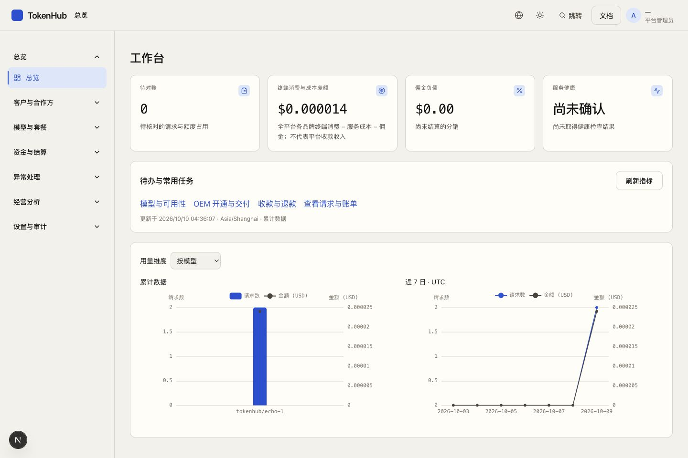
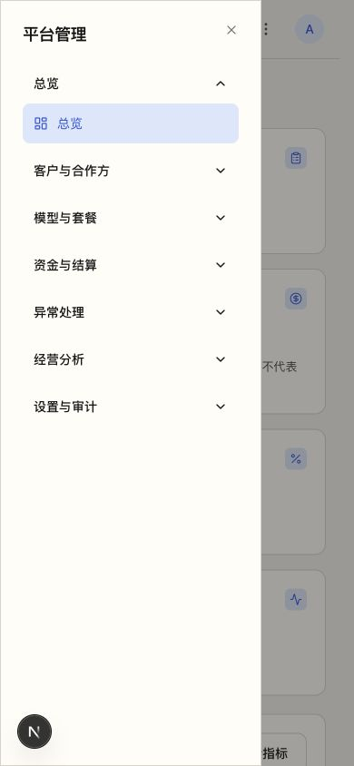
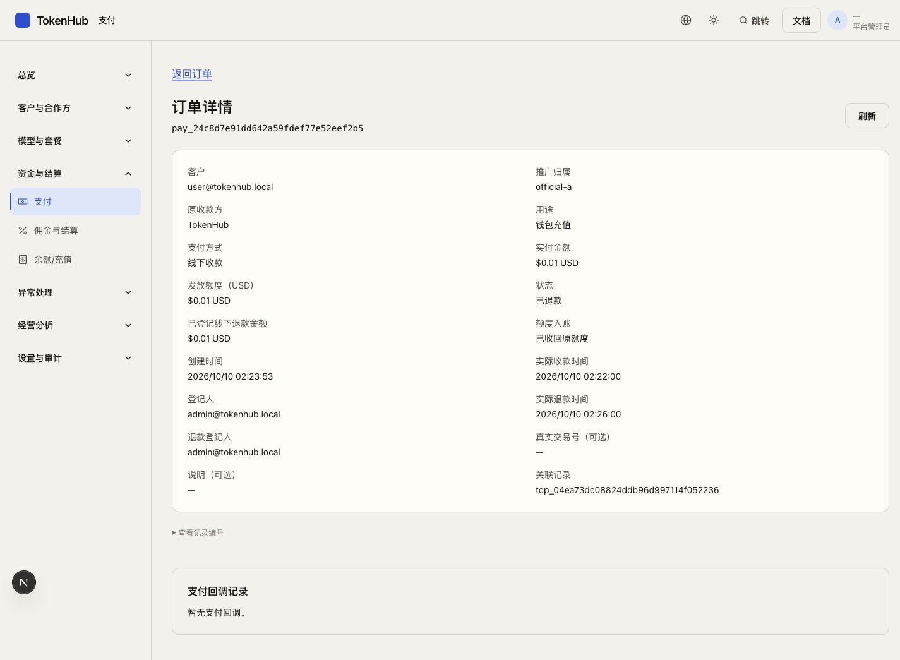

# 产品流程整改：整合验收与后续事项

状态：T00–T11 首轮本地整合验收于 `e76b852` 完成。2026-10-10 用户已补充确认实际扣费与独立经营规则，补充实施进行中；本文件的既有测试结果不代表新补丁已经通过。新决定与验收见 docs/30。

本文件汇总本次 T00–T11 的实际交付与验收边界；详细设计见 docs/18–20，分项实施证据见 docs/21–25，旧入口处置见最终路由清单。此处是本地代码与测试验收，不代表已经部署、真实支付成功或外部 Agent 已接通。

## 1. 已确定的业务边界

- 对外使用“平台、OEM、渠道”。数据库中的旧类型代码仅作内部兼容。
- 平台协助 OEM 配置到可营业，再交给 OEM 运营。交付阶段、历史交接事实与实时营业能力分别记录。
- 同品牌统一终端售价；渠道只影响推广归属及佣金，不采购、不收款、不拥有独立资金池。
- 普通用户先生成 Key，设置可用模型、累计 USD 上限和有效期，再按需要查看 Agent 配置或模型协议。无余额可以创建 Key、阅读说明；教程和测试不是使用前置条件。
- 普通用户的邀请、人数、赠送积分、分佣资格、佣金与结算记录集中在“邀请与收益”，使用同一个账户。
- 线下操作记录真实金额、时间与确认。交易参考号、正式票据及说明不强制；系统操作编号用于防止同一操作重复记账，不能冒充外部付款凭证。

## 2. 应从这些任务开始验收

| 角色 | 推荐任务 | 应能核对的结果 |
| --- | --- | --- |
| 平台运营 | OEM 与渠道 → 指定 OEM → 交付与营业 | 缺项、责任人与处理入口明确；已完成配置保留；只有具备事实证据才能交接 |
| 平台技术 | 模型与可用性 → 缺少能力的模型 → 原路由/账户配置 | 不重复创建已有路由；失败/未知不显示为健康；保存后回到原模型与筛选 |
| 品牌财务 | 客户 → 线下收款划拨 → 原订单 → 退款预览 | 原品牌、原收款主体、原额度池保持；实际金额与额度分开；不要求专业票据 |
| 品牌财务 | 佣金与结算 → 预览 → 待打款原单 → 实际打款登记 | 最低额、人数、条数、金额可核对；网络中断重试原操作；已打款后的冲正另记待收回 |
| 品牌财务 | 待收回原记录 → 登记部分收回 | 剩余金额准确，原付款和收款凭证可追溯，不自动扣 API 积分或后来佣金 |
| OEM 运营 | 自己品牌的交付/模型/客户/渠道/请求 | 只看到品牌内事实；普通客户请求证据与管理员登录分开；没有平台上游秘密 |
| 渠道 | 工作台 → 客户、推广、可用模型、本人佣金 | 没有收款、采购、资金池职责；新旧收益接口都只能读取本人收益 |
| 普通用户 | API Key → 使用说明 → 发出请求 → 查看本人请求 | 模型/Key/协议上下文保留；成功证据可点开；失败指向实际可解决的原因 |
| 普通用户 | 钱包 → 套餐/充值 → 订单流水；邀请与收益 | 余额、额度、佣金不混淆；成功写入后页面同步；暂时读不到数据不当成零 |
| 审计 | 客户、请求、订单、佣金原记录 | 有权读取的事实保留；写入、退款、打款和配置按钮不出现 |

## 3. 验证证据

最终整合代码为 `e76b852`。测试从该提交冻结独立快照运行，全部完成且退出码为 0；本地浏览器复验使用同一提交：

| 检查 | 已取得的证据 |
| --- | --- |
| 后端完整回归 | `e76b852` 的 `go test -p 1 ./... -count=1` 全部通过，15 个测试包，含 PostgreSQL、Redis、对象存储；app 41.302s、payment 0.307s。此前 `7b4726f` 已在从零建立的隔离库通过同组全量验证 |
| 前端单元测试 | `e76b852` 的 99 文件、476 用例全部通过 |
| 生产构建与类型检查 | `e76b852` 的 `npm run build`、构建后 `tsc --noEmit` 通过 |
| 完整浏览器回归 | `e76b852` 的 127/127 项全部通过（50.3s，单 worker）；包含首轮发现并修正的 4 项以及新增移动菜单回焦场景 |
| 历史库迁移 | 最终复核 27 张原事实表的原列内容/行数摘要：`changed=[]`；最终新增迁移清单与已验证版本相同 |
| 路由及静态链接 | 121行与原清单完全一致；扫描到的35个字面页面目标均有实际路由匹配，动态范围另由角色/对象测试覆盖 |

完整运行日志保留在本机 `/private/tmp/tokpath-final-e76b852-{go,web}.log`。首次整合发现的旧导航断言、客户姓名/邮箱退化、历史线下退款显示和移动菜单问题均已修复并复验。以下分项记录提供具体用例与实现依据。

原 121 个入口已逐项登记：81 项保留并调整任务组织，27 项合并/按角色分流，13 项退役。清单与原方案逐项比对无缺项/多项；这不等于逐个动态对象都做过浏览器验收。详见 [原路由实际处置记录](27-原121路由实际处置记录.md)。

已在隔离本地环境进行过真实浏览器操作：普通用户零余额创建带模型范围/USD 上限/到期时间的 Key；余额不足后的充值回程；平台测试调用成功的本人请求；客户搜索及返回；没有外部参考号的线下收款与退款登记；结算预览、实际打款登记、部分追回；审计只读；390px/1024px 页面与弹窗。

这些浏览器操作使用本地测试账户、合成付款事实和受控模型适配器。没有向真实客户发送邀请，没有发起真实转账，没有通过真实上游产生费用。测试调用成功只证明平台测试链路，不等于 Claude Code、Codex 或其他外部 Agent 已经配置成功。

迁移校验对旧基线中的账务、佣金、Key 和价格共 27 张表保存原有列的行数与内容摘要，再执行新增迁移比较；不通过重建数据库掩盖历史数据变化。全量回归另在独立新数据库运行。

## 4. 用户已确认的补充事项（2026-10-10）

此前四项已获回复，前三项不再作为业务待定：

- 可靠实际用量超预估仍全额扣费，允许Key超限和账户负余额，后续充值补齐；小额弃用损失由经营品牌承担。
- 平台与OEM独立经营。OEM毛利=终端实际计费−平台服务消耗成本；OEM付款且获得服务额度时采购交易完成，平台不依据OEM终端价确认自身经营。
- 全部现有数据都是测试数据，按需清理，不做复杂历史推广收益迁移。
- 正式运营资料尚未准备，仍为上线资料待补项。Agent与代码接入说明现在完善，真实域名/TLS、商户及外部工具接通仍需对应环境联调。

补充实现与验证进行中，见 [业务补充决策与验收](30-业务补充决策与验收.md)。

## 5. 实施与维护说明

- 新页面和旧入口兼容均受服务端权限约束。隐藏按钮不作为鉴权措施。
- 正常业务不改写原交易/价格/佣金快照，冲正保留原分录。用户已确认现有库全是测试数据，可按需重建；本轮不为测试数据开发复杂历史迁移。
- 部分佣金和供应商列表目前先取当前有权品牌的完整事实集，再进行稳定游标/搜索；消除了首 100 条截断问题，但数据量增长后仍需依据索引和实际规模下推查询。这是性能优化事项，不改变完整性口径。
- 已移除没有实现支撑的公开宣传入口和设置占位页；需要真实能力时再重新提供，不以空页面或说明文字假装功能完成。
- 旧 Git 基线仅用于代码比对；旧服务不认识新增 Key 限制与操作身份，不能直接回退运行并继续接受请求。生产回退须单独核对迁移/API兼容和写入状态。本轮没有执行部署或生产回滚；已写入的账务事实应使用对应业务冲正/恢复流程，不能删表撤销。

## 6. 验收矩阵的证据范围

下表记录任务书 G01–G30 的验证方式。自动化使用隔离数据库、对象存储、受控上游或浏览器响应；人工浏览器同样只操作本地测试环境。外部服务真实联调和初用者可用性测试仍待上线准备阶段执行。

| 场景 | 对应证据与边界 |
| --- | --- |
| G01、G04 | 角色导航、合法登录回程、工作区记忆与权限撤销测试；浏览器检查平台、OEM、渠道、普通账户与审计入口 |
| G02、G03 | 策略真实版本/失败不可保存、健康未知、工作台模块错误隔离；不会把读取失败写成零 |
| G05 | 单条与批量待核对处理集成测试，部分失败逐项返回；OEM保留原只读边界 |
| G06 | 客户/关系160条、订单/请求230条、钱包151条、结算/额度153条完整搜索和分页；浏览器客户详情返回测试 |
| G07、G08 | 模型缺项与原路由返回、授权撤回及同品牌渠道继承；浏览器模型任务和委托用例 |
| G09 | 品牌统一终端价、请求原价格快照及有效价格预算回归；渠道授权界面无独立定价 |
| G10、G11 | 收款/支出/购买稳定操作身份、数据库并发、原池最终校验及失败回滚；浏览器未知结果恢复 |
| G12、G13 | 原支付主体隔离、客户范围、管理员交接与即时权限测试；不更改历史客户归属或密码 |
| G14 | 品牌地址投影与协议示例实际本地HTTP执行；正式域名、证书及实际商户仍需环境验收 |
| G15 | 支付回调终态、金额/币种核验、已接收未应用重试、原订单履约与退款；浏览器原收款退款链 |
| G16、G17 | 原快照冲正、已付待收回、并发/重复/部分收回集成测试；浏览器实际记录部分收回 |
| G18 | 原操作持久恢复、异步任务和迟到响应隔离测试；浏览器刷新/回程/已确认后回读失败 |
| G19 | 完整SQL统计与日期/时区边界、原品牌损益与小额展示；不将平台全品牌技术统计当平台利润 |
| G20 | 实际浏览器零余额创建Key并设模型、USD上限、有效期；说明与充值返回保留上下文 |
| G21 | 关键表单键盘确认/取消与回焦、窄屏视觉检查和可访问名称测试；未声称使用真实屏幕阅读器完成体验验收 |
| G22、G23 | 只读角色与字段裁剪、OEM普通客户调用证据、接手登录与交接历史/现状分离；正式外域营业尚未验收 |
| G24、G25 | 周期/价格/正式报价、购买恢复、邀请与登录/OAuth意图及开放跳转拒绝；未执行真实扣款或Google授权 |
| G26、G27 | 分类错误恢复、本人请求证据、Key预算原子性/轮换/冲正/流式/媒体/失败关闭；有限额模型支持边界见下文 |
| G28 | 无外部参考号的收款/打款/收回浏览器流程，真实参考号按业务范围防重；内部操作编号独立 |
| G29 | 公开文本及媒体入口拒绝内部路由控制的回归；诊断入口独立鉴权并绑定本人测试Key |
| G30 | 权威文档正文与导航、表单、种子展示名统一术语；原数据库代码保留兼容映射 |

## 7. 明确的技术兼容边界

- 首轮有限额Key采用保守费用上界，2026-10-10用户已明确改为合理预估准入、按实际全额结算。取消绝对上界供应商白名单属于本次补充实现；最新状态见 [Key 实施记录](22-Key整改实现记录.md) 与 docs/30，不能引用首轮测试直接宣布新行为已验证。
- 示例可执行、本地工具调用不丢字段，不等于已验证所有外部 Agent 的完整生命周期。外部工具版本、真实上游与商户需单独联调。
- 原图像编辑接口没有真实编辑实现，已明确拒绝且不创建任务/扣费，不再宣传为可用；图像生成与真实本地对象存储分支保留验证。
- 初用者可用性测试尚未进行。此次证明的是实现和受控任务链可工作，不能据此声称首次使用者已无需帮助。

## 8. 关键界面证据

以下图片来自隔离本地环境的实际浏览器，数值为测试数据。

截图对应最终产品提交 `e76b852`。移动菜单关闭后，实际焦点回到“打开导航”按钮。线下退款详情显示原现金 $0.01、原额度已收回、实际退款时间 02:26 与原登记人，外部参考号和说明为空仍可追溯。

