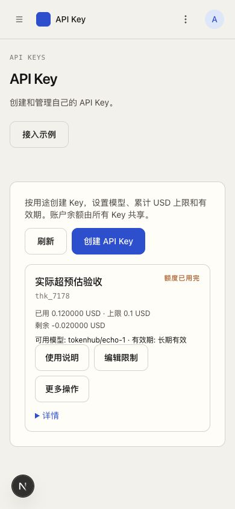
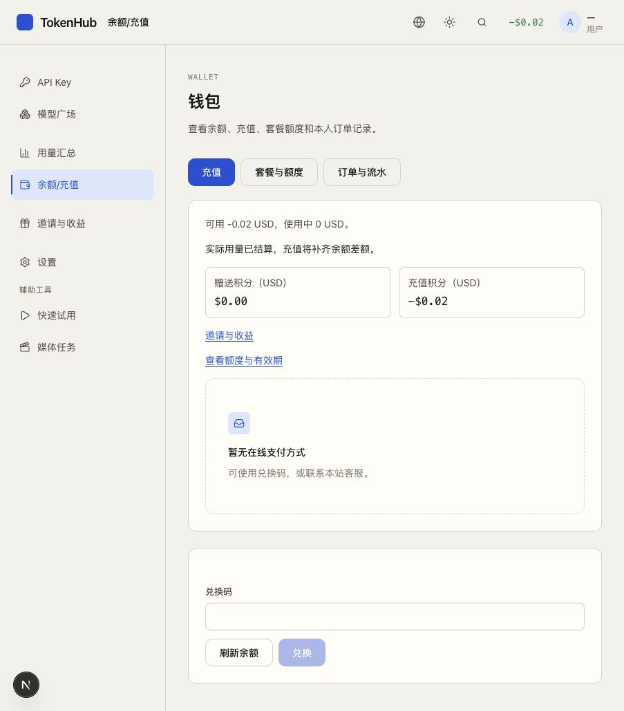
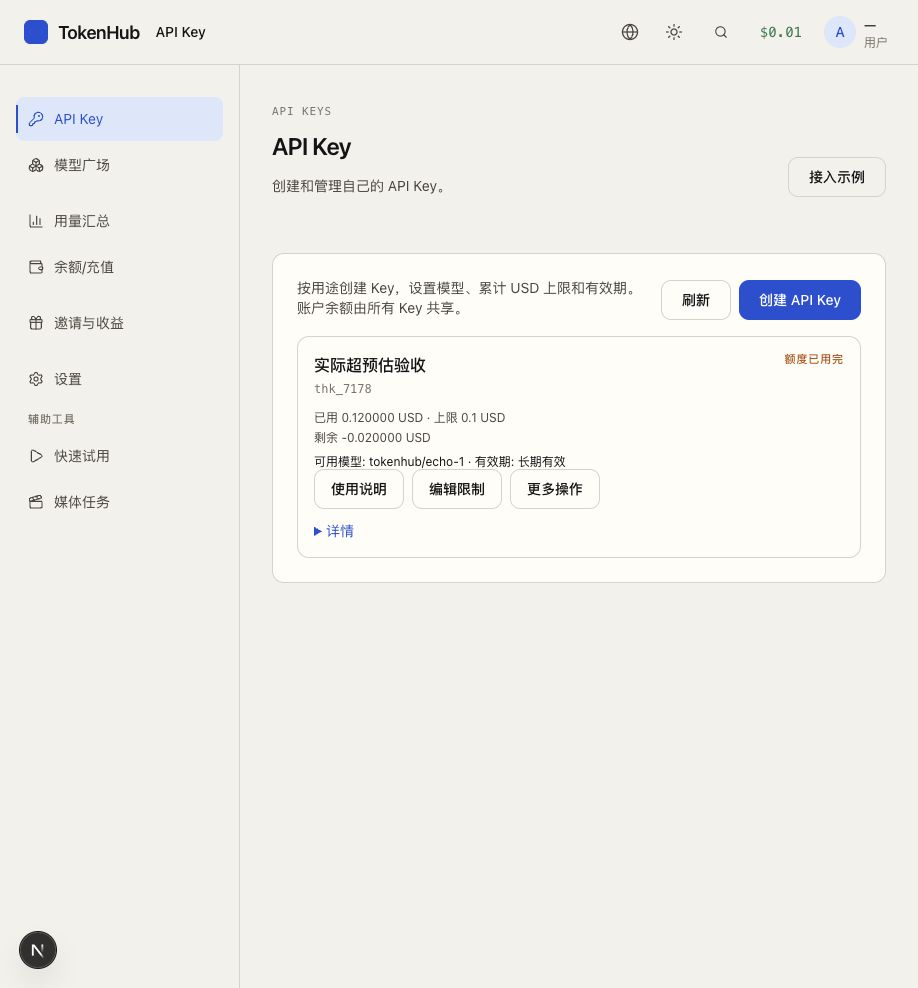
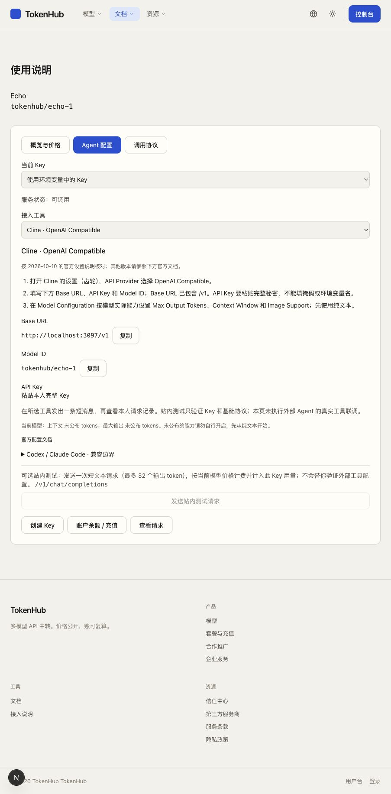

# 2026-10-10 业务补充决策与验收

状态：**已完成实施和本地整合验收**。产品代码 `11bda89`，最终浏览器验收测试 `706d41c`。首轮 `e76b852` 证据保留为历史，本文件记录补充规则的独立验证。

## 已确认的产品规则

### 请求前预估，执行后按实扣费

请求进入前以合理费用预估检查账户适用额度与逻辑 Key 累计限额，并原子占用，避免并发使用同一份余额。余额包括请求可用的套餐等权益；钱包的负余额必须计入，不能按零处理后扩大可用额。

已准入的请求按可靠实际用量和原价格快照结算。实际金额超过预估、Key 上限或钱包余额时仍完整记录、正常扣费和计佣；Key 已用可超过上限、剩余可为负，账户余额也可为负。没有可靠用量或结果未知时继续待核对，不拿预估金额冒充消费。

限额或余额不足时不再接受新请求；已准入请求继续结算。充值补齐账户欠额，但不重置 Key 已用、不改变 Key 上限。降低 Key 上限可立即限制新请求，不能因此阻止结算原请求或编辑无关字段。赠送余额与预留计数仍不得为负。

用户弃用账户形成的小额欠额由所属经营品牌平台/OEM各自承担。本轮不增加催收、信用额度、自动核销或对外追偿流程。

### 平台与 OEM 独立经营

| 事实 | 平台 | OEM |
| --- | --- | --- |
| OEM 实付 1,000，平台划转对应服务额度 | 双方该笔交易完成，记录服务额度销售及实际收款 | 记录采购支付和取得的服务额度 |
| OEM 终端实际计费 150，按平台结算价消耗 100 | 不把 150 算平台收入，不依赖 OEM 零售价完成前述销售 | 消费收入 150、实际服务成本 100、API 毛利 50 |
| 尚未消耗的采购额度 | 保留额度履约和技术服务记录 | 保留剩余额度，不把 1,000 再扣到本期 API 毛利 |
| 营销、佣金与供应商现金支出 | 按本品牌事实单独核算 | 按本品牌事实单独核算；不重复扣预付现金和实际消耗成本 |

平台日常经营报表不混入 OEM 终端消费收入；有权技术排障可读取必要原请求/价格事实。无现金的额度调整不冒充销售。原现金金额/币种、协议 USD 销售金额和发放额度分别记录，不推测汇率、不把积分面额当实收款。

### 测试数据与上线资料

所有现有数据均为未上线测试数据；不为未绑定推广记录开发历史收益迁移。遇到不兼容数据可按需重建相关测试库，不把清库加入正常业务操作。

运营主体、真实供应商及地区资料尚未准备，保留为上线资料项。现在完善 Agent 配置和代码接入说明，使用当前品牌地址、实际公开模型及协议能力。“主流模型和地区都会支持”是产品目标，不应写成当前部署已验证的清单。

## 补充验收场景

| 场景 | 期望结果 |
| --- | --- |
| 预估可用 0.10，实际消费 0.12 | 确认消费 0.12、Key 已用 0.12，钱包可为 -0.02；不因超预估进入待核对 |
| 超额后再次调用、随后充值 | 不足时拒绝新请求；充值补齐账户，Key 已用不清零；Key 仍超限时需要提高上限或另用有权 Key |
| 并发准入与并发实际结算 | 准入不重复占用余额；已接受请求按各自实际金额结算，计费/佣金仅一次 |
| 重复回调、原请求冲正、套餐和媒体 | 重放不重复扣费；原事实冲正可追溯；套餐不足后的差额与媒体实际结算保持同一规则 |
| 缺用量或执行结果未知 | 保留占用和原请求待核对，不凭预估扣费或直接释放 |
| OEM 采购登记重试、无现金额度调整 | 同一采购只收录/发放一次；两方原单可追溯；无现金调整不计销售 |
| OEM 采购误录 | 以原单登记撤销，原额度足额可收回时原子撤销额度与销售；保留原因、操作人和原事实，不触发外部退款 |
| 上游成本与客户退款 | 文本及媒体的真实成本均入账；重复回调不重复记成本，退还客户费用不自动抹去已发生上游成本 |
| OEM 150/100 与 120/100 对比 | OEM API 毛利分别50、20；平台销售与成本不因OEM售价变化而改变 |
| 平台/OEM经营与技术排障 | 默认经营范围独立；跨品牌记录仅出现在明确有权的排障场景 |
| Agent/代码说明 | 当前品牌地址、选定模型/Key上下文保持；具体设置/可复制片段/成功验证清楚；不宣称未实现协议已兼容 |
| 文案与新手恢复 | 超额/负余额显示真实数值和正确操作；不迫使普通用户选择上游、路由或读内部业务说明 |

## 实施与最终证据

- Key/实际结算：见 [Key实施记录](22-Key整改实现记录.md)。
- 平台/OEM经营：见 [经营口径补充实施记录](28-经营口径补充实施记录.md)。
- Agent/代码接入：见 [Agent与代码接入实施记录](29-Agent与代码接入实施记录.md)。
- 后端完整复验：`bf7424e` 的独立快照、新测试库 `tokpath_business_final2` 上执行 `go test -p 1 ./... -count=1`，15 个测试包全部通过（app 42.298s），SDK依赖实际挂载启用。日志 `/private/tmp/tokpath-final-bf7424e-go.log`。
- 前端完整复验：`11bda89` 独立快照，104文件、505个单元测试，生产构建与构建后TypeScript全部通过。日志 `/private/tmp/tokpath-final-11bda89-web.log`。该轮浏览器133/135；两处旧经营入口/标题断言在 `706d41c` 同步后，全部135项复跑通过（53.5s），日志 `/private/tmp/tokpath-final-706d41c-browser.log`。
- 后续提交只改验收测试、文档与截图，产品代码保持上述已验证版本。外部真实支付、收费上游和完整 Agent 客户端联调不以本地模拟代替。

### 整合复验发现并修正的问题

- 可靠用量确认后会同时留下旧缺口和新扣费事实。重复回放改为绑定原扣费的用量记录，避免随机记录排序造成合法重放 400；不同实际用量仍拒绝，余额不重复变化。
- 佣金预览原测试在数据未就绪、按钮仍禁用时点击；受控延迟证明页面正确阻止了请求。测试现等待同范围数据就绪，保留人数、金额与原单返回断言。
- Key 列表在平板宽度隐藏关键额度。1280px 以下改用完整信息卡片，390px/903px 实测状态、已用、上限、负剩余、模型与有效期可见且不横溢出；头部负余额统一为 `-$0.02`。
- 使用说明由服务端传入真实入口和查询上下文，首次HTML与浏览器首次渲染一致，避免创建Key/充值回错说明页；四入口SSR/hydration与刷新均通过。
- 旧平台毛利跳转到技术毛利页的测试已按实际经营入口更新；财务岗位的OEM额度/采购标题与模拟接口同步，同时保留金额、禁写上游和组织权限检查。

### 实际网页证据

预览 `http://localhost:3096` 使用 `11bda89`，只有测试账户和受控适配器。本次直接用内部账务服务构造预估/实际用量事实，没有请求付费模型；SDK测试单独使用本地HTTP服务。测试账户先入账0.10，预留0.10后确认0.12：钱包-0.02、Key已用0.12、上限0.10、剩余-0.02；再入账0.03，余额成为0.01，Key累计用量保持0.12，说明页面仍明确该Key额度已用完。

### 上线前仍需补齐

运营主体、正式域名/TLS、真实支付商户和供应商/地区资料尚未提供；真实支付、收费上游及Cline/Aider完整外部会话未联调。Codex/Claude Code原生协议仍缺完整兼容，页面明确说明，不能当作已支持；初用者可用性测试仍需实际测试者。上述是上线资料和外部技术验证条件，已确认的四项业务决定没有遗留待问问题。
